<!DOCTYPE html>
<html>
<head>
    <meta charset="UTF-8">
    <title>系统能力综合实训成绩评定</title>
</head>
<body>
    <table border="1" style="text-align: center;">
        <h2><center>《系统能力综合实训》成绩评定标准</center></h2>
        <tr>
            <th rowspan="2">毕业要求</th>
            <th colspan="3">考核与评价方式</th>
            <th rowspan="2">成绩比例（%）</th>
        </tr>
        <tr>
            <th>系统演示</th>
            <th>项目答辩</th>
            <th>实训报告</th>
        </tr>
        <tr>
            <td style="text-align: left;">实训目标1：设计/开发解决方案</td>
            <td>10</td>
            <td>/</td>
            <td>20</td>
            <td></td>
        </tr>
        <tr>
            <td style="text-align: left;">实训目标2：研究</td>
            <td>/</td>
            <td>20</td>
            <td>10</td>
            <td></td>
        </tr>
        <tr>
            <td style="text-align: left;">实训目标3：使用现代工具</td>
            <td>/</td>
            <td>10</td>
            <td>10</td>
            <td></td>
        </tr>
        <tr>
            <td style="text-align: left;">实训目标4：个人和团队</td>
            <td>10</td>
            <td>/</td>
            <td>10</td>
            <td></td>
        </tr>
        <tr>
            <td style="text-align: left;">合计</td>
            <td colspan="3"> </td>
            <td></td>
        </tr>
    </table>
</body>
</html>

<!DOCTYPE html>
<html>
<head>
    <meta charset="UTF-8">
    <title>系统能力综合实训成绩评定</title>
</head>
<body>
    <table border="1" style="text-align: center;">
        <h2><center>《系统能力综合实训》成绩评定</center></h2>
        <tr>
            <th rowspan="2">毕业要求</th>
            <th colspan="3">考核与评价方式</th>
            <th rowspan="2">成绩比例（%）</th>
        </tr>
        <tr>
            <th>系统演示</th>
            <th>项目答辩</th>
            <th>实训报告</th>
        </tr>
        <tr>
            <td style="text-align: left;">实训目标1：设计/开发解决方案</td>
            <td>10</td>
            <td>/</td>
            <td>20</td>
            <td></td>
        </tr>
        <tr>
            <td style="text-align: left;">实训目标2：研究</td>
            <td>/</td>
            <td>20</td>
            <td>10</td>
            <td></td>
        </tr>
        <tr>
            <td style="text-align: left;">实训目标3：使用现代工具</td>
            <td>/</td>
            <td>10</td>
            <td>10</td>
            <td></td>
        </tr>
        <tr>
            <td style="text-align: left;">实训目标4：个人和团队</td>
            <td>10</td>
            <td>/</td>
            <td>10</td>
            <td></td>
        </tr>
        <tr>
            <td style="text-align: left;">合计</td>
            <td colspan="3"> </td>
            <td></td>
        </tr>
    </table>
</body>
</html>

<center><h1>基于Verilog的MIPS单周期硬布线处理器实现</h1></center>

<center><h2>学生姓名：胡锦豪        指导老师：何施茗</h2></center>

**摘要：为了熟悉MIPS指令集，Verilog语言以及单周期硬布线CPU，实现了这个MIPS单周期硬布线处理器。处理器使用 Verilog HDL实现。总共实现了 29 条 MIPS 指令，包括 ADD, ADDU, SUB, SUBU, SLT, SLTU, AND, OR, XOR, NOR, SLL, SRL, SRAV, SLLV, SRLV, SRAV, JR, ADDI, ADDIU, SLTI, SLTIU, ANDI, ORI, XORI, LW, SW, BEQ, BNE, J。对所有指令都分析了需要的部件和数据通路，并对需要的部件进行不断的完善 ，搭建了最终的数据通路和模块，然后使用Verilog HDL连接了所有模块，包括PC模块，通用寄存器堆(GPR)，取指令模块(IFU)，控制器模块(Ctrl)，数据存储器模块(DM)，指令存储器模块(IM)，算数逻辑单元(ALU)，16位扩展成32位扩展器，多个复用器，构成了一个MIPS单周期硬布线处理器。编写了针对R型指令，I型和J型指令的汇编测试代码并转换成16进制载入了指令存储器中进行验证。使用Vivado进行仿真测试，通过分析仿真图验证了所有R型，I型和J型指令的正确性，并且最终使用这些指令实现了对100个乱序32位数的冒泡排序。** 

**关键词：Verilog HDL；CPU；MIPS；Vivado**

<center><h1>
    基于Verilog的MIPS单周期硬布线MIPS处理器
    </h1></center>

<center>Student name: Jinhao Hu   Advisor：Shiming He</center>

**Abstract：To become proficient with the MIPS instruction set, Verilog language, and the design of a single-cycle hardwired CPU, a single-cycle MIPS hardwired processor was implemented using Verilog HDL. This MIPS processor encompasses the implementation of 29 MIPS instructions, including ADD, ADDU, SUB, SUBU, SLT, SLTU, AND, OR, XOR, NOR, SLL, SRL, SRAV, SLLV, SRLV, SRAV, JR, ADDI, ADDIU, SLTI, SLTIU, ANDI, ORI, XORI, LW, SW, BEQ, BNE, and J. For each instruction, the necessary components and data paths were analyzed, and the required parts were continuously refined to construct the final data paths and modules. Then, using Verilog HDL, all modules were interconnected, including the Program Counter (PC) module, General Purpose Register (GPR), Instruction Fetch Unit (IFU), Control Unit (Ctrl), Data Memory (DM), Instruction Memory (IM), Arithmetic Logic Unit (ALU), 16-bit to 32-bit extender, multiplexers, forming a single-cycle hardwired MIPS processor. Assembly test code was written for R-type, I-type, and J-type instructions, converted into hexadecimal, and loaded into the instruction memory for verification. Simulation tests were conducted with Vivado, and the correctness of all R-type, I-type, and J-type instructions was verified through the analysis of the simulation waveforms. Ultimately, these instructions were used to implement a bubble sort on an array of 100 randomly ordered 32-bit numbers, confirming the correct sorting result.**

**Keywords：Verilog HDL；CPU；MIPS；Vivado；**

[TOC]

## 1. 实训要求和目标

### 1.1 实训要求

设计存数、取数、加法、减法、转移指令的单周期CPU。自行设计一段使用这些指令的程序（如冒泡排序、二分法排序等），存到存储器中，然后用你所设计的模型机运行这段程序，输出结果。

### 1.2 实训目标

- **指令条数越多，运行程序越复杂，分数越高。**
- **设计20条指令以上，能运行冒泡排序、二分法排序等程序**

## 2. 工具

### 2.1 硬件

- 无

### 2.2 软件

1. **操作系统：**`Win 11`
2. **开发平台：**`Vivado 2024.2,MARS,VSCode`
3. **编程语言：**`Verilog HDL`

## 3. 处理器的设计步骤

### 总体步骤

1. **选定指令系统：**将指令功能用RTL来表示
2. **设计部件和通路：**根据指令功能设计功能部件，比如ALU等，并考虑各部件如何相连
3. **分析所有指令在通路上的执行过程，并设计控点：**确定所有功能部件，数据通路所需控制信号(有多少控点就需要多少控制信号)
4. **分析指令信号序列：**汇总所有指令的控制信号序列，生成指令与控制信号关系表
5. **设置控制器：**根据关系表设计微指令，微程序，或生成每个控制信号的逻辑表达式，设计硬布线控制器

### 3.1 指令系统选取

**实验选取MIPS指令集**

#### 3.1.1 MIPS指令格式[^1]

1. **R型指令：**纯寄存器指令，所有的操作数(除移位外)均保存在寄存器中。OP字段均为0，使用Funct字段区分指令

   | R型指令 | 000000(6bits) | R~s~(5bits) | R~t~(5bits) | R~d~(5bits) | shamt(5bits) | funct(6bits) |
   | ------- | ------------- | ----------- | ----------- | ----------- | ------------ | ------------ |

   - 包括ALU指令，专用寄存器读/写指令，move指令等
   - **OP：**指令的基本操作-操作码
   - **R~s~：**第一个源操作数寄存器的编号(5位可表示32个寄存器，对应寄存器堆中的32个寄存器)
   - **R~t~：**第二个源操作数寄存器的编号
   - **R~d~：**存放结果的目的操作寄存器
   - **Shamt：**偏移量，用于移位指令
   - **Funct：**函数，对操作码进行补充

2. **I型指令：**带立即数的指令，最多使用两个寄存器，同时包括了load/store指令。使用OP字段区分指令

   | I型指令 | OP(6bits) | R~s~(5bits) | R~t~(5bits) | 立即数(16bits) |
   | ------- | --------- | ----------- | ----------- | -------------- |

   - 包括所有的load和store指令，立即数指令，分支指令，寄存器跳转指令，寄存器链接跳转指令

3. **J型指令**

   | J型指令 | OP(6bits) | 立即数(26bits) |
   | ------- | --------- | -------------- |

   - 包括跳转指令，跳转并链接指令，自陷指令，异常返回指令
   - 在这类指令中，指令字的低26位是偏移量，它与PC值相加形成跳转的地址

#### 3.1.2 指令选取

**对于R型指令，根据funct字段确定具体指令；对于I型指令和J型指令，根据op字段确定具体指令。**

**R型指令选取(17条)**

见[表-3.1.2-1]

| 指令   | [31:26]op | [25:21]rs | [20:16]rt | [15:11]rd | [10:6]shamt | [5:0]funct | 功能                                |
| ------ | --------- | --------- | --------- | --------- | ----------- | ---------- | ----------------------------------- |
| `ADD`  | 000000    | rs        | rt        | rd        | 00000       | 100000     | `R[rd]=R[rs]+R[rt]`                 |
| `ADDU` | 000000    | rs        | rt        | rd        | 00000       | 100001     | `R[rd]=R[rs]+R[rt]`(无符号数)       |
| `SUB`  | 000000    | rs        | rt        | rd        | 00000       | 100010     | `R[rd]=R[rs]-R[rt]`                 |
| `SUBU` | 000000    | rs        | rt        | rd        | 00000       | 100011     | `R[rd]=R[rs]-R[rt]`(无符号数)       |
| `SLT`  | 000000    | rs        | rt        | rd        | 00000       | 101010     | `R[rd]=(R[rs]<R[rt])?1:0`           |
| `SLTU` | 000000    | rs        | rt        | rd        | 00000       | 101011     | `R[rd]=(R[rs]<R[rt])?1:0`(无符号数) |
| `AND`  | 000000    | rs        | rt        | rd        | 00000       | 100100     | `R[rd]=R[rs]&R[rt]`                 |
| `OR`   | 000000    | rs        | rt        | rd        | 00000       | 100101     | `R[rd]=R[rs]|R[rt]`                 |
| `XOR`  | 000000    | rs        | rt        | rd        | 00000       | 100110     | `R[rd]=R[rs]^R[rt]`                 |
| `NOR`  | 000000    | rs        | rt        | rd        | 00000       | 100111     | `R[rd]=~(R[rs]|R[rt])`              |
| `SLL`  | 000000    | 00000     | rt        | rd        | shamt       | 000000     | `R[rd]=R[rt]<<shamt`                |
| `SRL`  | 000000    | 00000     | rt        | rd        | shamt       | 000010     | `R[rd]=R[rt]>>shamt`                |
| `SRA`  | 000000    | 00000     | rt        | rd        | shamt       | 000011     | `R[rd]=R[rt]>>shamt`(符号位保留)    |
| `SLLV` | 000000    | rs        | rt        | rd        | 00000       | 000100     | `R[rd]=R[rt]<<R[rs]`                |
| `SRLV` | 000000    | rs        | rt        | rd        | 00000       | 000110     | `R[rd]=R[rt]>>R[rs]`                |
| `SRAV` | 000000    | rs        | rt        | rd        | 00000       | 000111     | `R[rd]=R[rt]>>R[rs]`(符号位保留)    |
| `JR`   | 000000    | rs        | 00000     | 00000     | 00000       | 001000     | `PC=R[rs]`                          |

<center>[表-3.1.2-1-R型指令选取]</center>

**I型指令选取(11条)**

见[表-3.1.2-2]

| 指令    | [31:26]op | [25:21]rs | [20:16]rt | [15:0]im={rd,shamt,funct} | 功能                                      |
| ------- | --------- | --------- | --------- | ------------------------- | ----------------------------------------- |
| `ADDI`  | 001000    | rs        | rt        | im                        | `R[rt]=R[rs]+SignExt[im]`                 |
| `ADDIU` | 001001    | rs        | rt        | im                        | `R[rt]=R[rs]+ZeroExt[im]`(无符号数)       |
| `SLTI`  | 001010    | rs        | rt        | im                        | `R[rt]=(R[rs]<SignExt[im])?1:0`           |
| `SLTIU` | 001011    | rs        | rt        | im                        | `R[rt]=(R[rs]<ZeroExt[im])?1:0`(无符号数) |
| `ANDI`  | 001100    | rs        | rt        | im                        | `R[rt]=R[rs]&ZeroExt[im]`                 |
| `ORI`   | 001101    | rs        | rt        | im                        | `R[rt]=R[rs]|ZeroExt[im]`                 |
| `XORI`  | 001110    | rs        | rt        | im                        | `R[rt]=R[rs]^ZeroExt[im]`                 |
| `LW`    | 100011    | rs        | rt        | im                        | `R[rt]=Mem[R[rs]+SignExt[im]]`            |
| `SW`    | 101011    | rs        | rt        | im                        | `Mem[R[rs]+SignExt[im]]=R[rt]`            |
| `BEQ`   | 000100    | rs        | rt        | im                        | `PC=(R[rs]==R[rt])?PC+4+im<<2:PC+4`       |
| `BNE`   | 000101    | rs        | rt        | im                        | `PC=(R[rs]!=R[rt])?PC+4+im<<2:PC+4`       |

<center>[表-3.1.2-2-I型指令选取]</center>

**J型指令选取(1条)**

见[表-3.1.2-3]

| 指令 | [31:26]op | [25:0]address | 功能                            |
| ---- | --------- | ------------- | ------------------------------- |
| `J`  | 000010    | address       | `PC={(PC+4)[31:28],address<<2}` |

<center>[表-3.1.2-3-J型指令选取]</center>

**总体指令选取**

共29条，见[表-3.2.4-4]

| 指令类型           | R型指令-17条               | I型指令-11条  | J型指令-1条 |
| ------------------ | -------------------------- | ------------- | ----------- |
| **算数指令**       | ADD,ADDU,SUB,SUBU          | ADDI,ADDIU    |             |
| **逻辑指令**       | AND,OR,XOR,NOR             | ANDI,ORI,XORI |             |
| **移位指令**       | SLL,SRL,SRA,SLLV,SRLV,SRAV |               |             |
| **数据传输指令**   |                            | LW,SW         |             |
| **分支指令**       |                            | BEQ,BNE       |             |
| **跳转和链接指令** | JR                         |               | J           |
| **比较指令**       | SLT,SLTU                   | SLTI,SLTIU    |             |

<center>[表-3.2.4-4-总体指令选取]</center>

#### 3.1.3 指令处理流程

如[图-3.1.3-1-指令处理流程]

1. **取指令**：
   - 程序计数器（PC）指向内存中的下一条指令。
   - 从内存中取出指令，并将其送入指令寄存器。
2. **指令解码**：
   - 根据指令寄存器中的指令代码，解码器确定指令的类型和操作。
   - 确定需要哪些操作数（如寄存器、内存地址或立即数）。
3. **执行**：
   - 根据解码结果，执行算术或逻辑操作。
   - 对于分支指令，执行分支条件的计算。
4. **访存**：
   - 对于访问内存的指令（如加载和存储指令），执行内存访问操作。
   - 从内存中读取数据或将数据写入内存。
5. **写回**：
   - 将执行结果写回寄存器文件。
   - 对于分支指令，如果条件满足，则更新程序计数器。


<center>[图-3.1.3-1-指令处理流程]</center>

### 3.2 设计部件和数据通路，引入控制信号(Control Signals[^5])

#### 3.2.1 核心部件设计

##### 3.2.1.1 PC(程序计数器)

- **原理**：PC是一个寄存器，用于存储当前执行的指令的地址。
- **作用**：在顺序执行中，PC在每个时钟周期自增，以指向下一条指令。在分支或跳转指令执行时，PC可能会更新为非顺序的新地址。

##### 3.2.1.2 IM(指令存储器)

- **原理**：IM是一个只读存储器，用于存储处理器将要执行的指令集合。
- **作用**：根据PC提供的地址，IM提供当前要执行的指令。它是指令获取阶段的关键部件。
- **大小**：32位$\times$1KB，可存储1024条32位指令

##### 3.2.1.3 Ext16to32(16位扩展为32位扩展器)

- **原理**：将16位的立即数扩展为32位，可以是符号扩展或零扩展。
- **作用**：用于I型指令，确保立即数与寄存器中的值具有相同的位宽，以便进行算术或逻辑运算。

##### 3.2.1.4 RegFile(寄存器堆)

- **原理**：一组32位宽的寄存器，用于存储操作数和运算结果。
- **作用**：提供快速的数据存储和访问，用于保存处理器的状态和临时数据。

##### 3.2.1.5 ALU(算数逻辑单元)

- **原理**：执行算术和逻辑运算的硬件单元。
- **作用**：进行加法、减法、与、或、异或等操作，是处理器执行指令的核心部件。

##### 3.2.1.6 DM(数据存储器)

- **原理**：用于存储数据的随机访问存储器。
- **作用**：在加载和存储指令中，用于从内存中读取数据或将数据写入内存。
- **大小**：32位$\times$1KB，可存储1024条32位指令

##### 3.2.1.7 CONTROLER(控制器)

- **原理**：根据指令的操作码和功能码生成控制信号。
- **作用**：控制处理器的数据通路，指导各个部件如何协同工作以执行指令。

#### 3.2.2 数据通路和部件完善及控制信号引入

**以下是对指令的分析，建立数据通路，完善部件以及在需要时建立控点并引入控制信号**

##### 3.2.2.1 IFU(取指令数据通路)

对于所有的指令，都有一个共同的数据通路，称为**IFU**，如[图3.2.2.1-IFU_v1]

- `clk`：PC时钟脉冲信号，在脉冲的上升沿更新PC
- `rst_PC`：PC复位信号，为0时设置pc为0，`pc = 32'h0000_0000;`
- **PC输出：**
  - 输入 Adder 执行 `PC+4` 以获取下一条指令的地址
  - 输入 IM 作为下一条指令的地址 `Addr` 取出指令 `inst`
- **IM输出：**
  - 输出32位的指令字

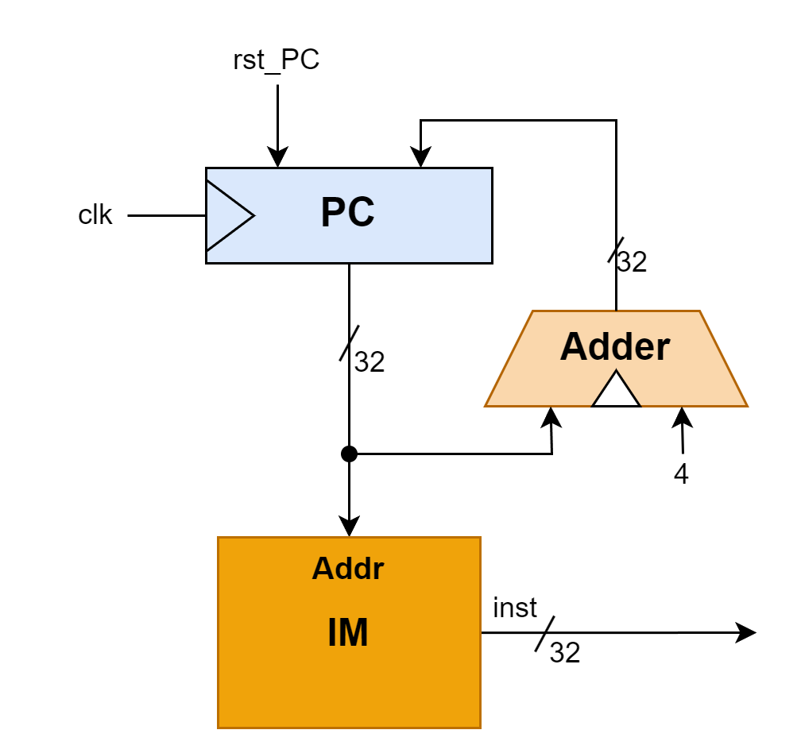

<center>[图3.2.2.1-IFU_v1]</center>

##### 3.2.2.2 分析R型指令ADD，设计数据通路

**(1)ADD的操作**

- R[rd]<-R[rs]+R[rt]
- 将rs对应的寄存器和rt对应的寄存器的内容相加存放到rd对应的寄存器中

**(2)设计数据通路**

需要一个寄存器堆和一个算数逻辑单元，寄存器堆需要读取rs，rt对应的寄存器的内容并输出，算术逻辑单元需要对输出的数进行加法运算并输出，同时还需要一个控制信号来指定执行`ADD`指令，寄存器堆还需要将算数逻辑单元的输出写入到rd对应的寄存器，引入一个控制信号控制寄存器的写入，还需要一个时钟脉冲以定期执行操作[^2]

如[图3.2.2.2-ADD指令数据通路]

- `RegFile`：
  - `clk`：时钟脉冲，上升沿时进行寄存器的读写
  - `rs,rt,rd`：对应ADD操作中的寄存器编号
  - `busW`：结果写回
  - `busA`：寄存器rs对应的内容
  - `busB`：寄存器rt对应的内容
  - `WrEn`：写使能控制端，由==<u>RegWr</u>==控制
- `ALU`：
  - 左边两个输入对应两个源操作数
  - `ALU_out`：对应ADD操作的结果
  - ==<u>ALUCtr</u>==
- **控制信号**：
  - ==<u>RegWr</u>==：控制寄存器堆的写入
  - ==<u>ALUCtr</u>==：ALU执行的操作控制信号，6位，对应funct或op字段，表示不同的操作指令

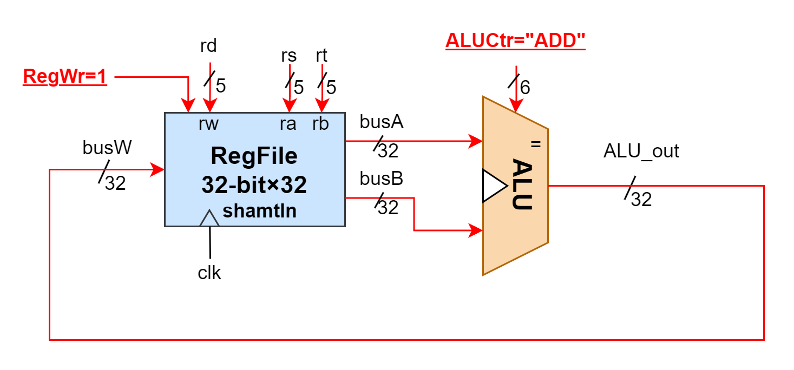

<center>[图3.2.2.2-ADD指令数据通路]</center>

**(3)分析需求相同的指令**

**对于以下指令，需要的部件和控制信号与ADD基本相同：**

- ADDU,SUB,SUBU,SLT,SLTU,AND,OR,XOR,NOR

##### 3.2.2.3 分析R型指令SLL

**(1)SLL的操作：**

- R[rd]<-R[rt]<<shamt
- 将rt寄存器对应的内容左移shamt位，结果存入rd对应的寄存器中

**(2)设计数据通路**

相较于[图3.2.2.2-ADD指令数据通路]所示的数据通路，ALU还需要一个输入，即shamt字段，因此稍加改造即可得到需要的数据通路

- RegFile添加一个shamt输入和一个shamt输出
- ALU添加一个shamt输入

如图[3.2.2.3-SLL指令数据通路]

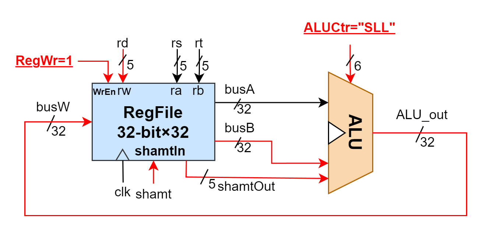

<center>[3.2.2.3-SLL指令数据通路]</center>

**(3)分析需求相同的指令**

**对于以下指令，需要的部件和控制信号与ADD基本相同：**

- SLL,SRL,SRA,SLLV,SRLV,SRAV

其中SRA和SRAV指令需要右移并保留符号位，其实就是对右移后数将符号位赋值给最高位，由于Verilog中有有符号的右移操作符号，因此可以直接使用。对于SRA，右移位数是shamt，而对于SRAV，右移位数选取rs对应的寄存器的低5位

```verilog
SRA: begin
    ALU_out = src2 >>> shamt;
    // 或者使用位拼接
    // ALU_out = {src2[31], src2[31:shamt]};
end
SRAV: begin
    ALU_out = src2 >>> src1[4:0];
end
```

##### 3.2.2.4 分析跳转指令

选取的指令中有4条跳转指令(JR,BEQ,BNE,J)，加上PC自增的取址方式共有5种获取新指令地址的方式，故需要一个5选1多路复用器[图3.2.2.4-5选1多路复用器]

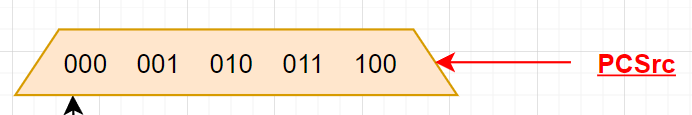

<center>[图3.2.2.4-5选1多路复用器]</center>

**实现跳转指令**

- 写出伪代码
- 完善数据通路，部件以及添加控制信号

**(1)写出伪代码：**

- 对于==<u>PCSrc</u>==控制信号：
  - 3'b000：PC自增4
  - 3'b001：JR
  - 3'b010：BEQ
  - 3'b011：BNE
  - 3'b100：J

```verilog
parameter PCADD4 = 3'b000;
parameter JR     = 3'b001;
parameter BEQ    = 3'b010;
parameter BNE    = 3'b011;
parameter J      = 3'b100;

always @(posedge clk) begin
    case (PCSrc)
        PCADD4:  PC <= PC + 4;
        JR:      PC <= R[rs];
        BEQ:     PC <=(R[rs]==R[rt])?PC+4+SignExt[im]<<2:PC+4;
        BNE:     PC <=(R[rs]!=R[rt])?PC+4+SignExt[im]<<2:PC+4;
        J:       PC <={(PC+4)[31:28],address<<2};
        default: PC <=PC;
    endcase
end
```

**(2)完善数据通路和部件，并引入必要的控制信号**

- **对于JR指令：**
  - ==<u>PCSrc</u>===3'b001
  - 将RegFile的输出busA作为分支地址
- **对于BEQ指令：**
  - ==<u>PCSrc</u>===3'b010
  - 在ALU中比较R[rs]和R[rt]，输出equal信号，送入控制器中，当equal=1时表示R[rs]==R[rt]，此时PC需要跳转到PC自增4再加上有符号扩展后的16位立即数对应的地址
  - 在IFU中添加一个16位扩展为32位的扩展器Ext16to32，并且引入控制信号==<u>ExtOp</u>==以控制有符号扩展(==<u>ExtOp</u>===1)和无符号扩展(==<u>ExtOp</u>===0)，BEQ指令是对16位立即数进行有符号扩展，故==<u>ExtOp</u>===1
  - 还需要对扩展后的数进行左移2位操作，因此需要引入一个移位器
- **对于BNE指令：**
  - ==<u>PCSrc</u>===3'b011
  - 在ALU中比较R[rs]和R[rt]，输出equal信号，送入控制器中，当equal=0时表示R[rs]!=R[rt]，此时PC需要跳转到PC自增4再加上有符号扩展后的16位立即数对应的地址
  - 其它组件与BEQ指令需求基本相同
- **对于J指令：**
  - ==<u>PCSrc</u>===3'b100
  - 选取PC+4后的高4位和指令字低26位立即数左移2位后的数进行拼接得到分支地址
  - 需要对指令字的低26位立即数进行左移2位操作
  - 需要对PC+4后的高4位和左移后的立即数进行拼接操作

对于以上分析，对已有的数据通路进行改进

- 改进后的取指令数据通路，如[图3.2.2.4-跳转指令通用数据通路-1]
- 改进后的寄存器堆和ALU等数据通路，如[图3.2.2.4-跳转指令通用数据通路-2]

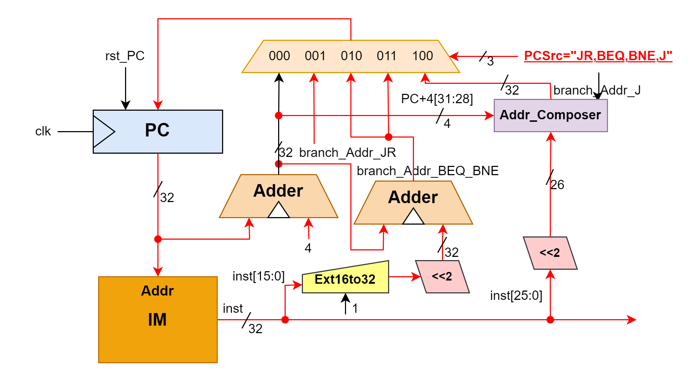

<center>[图3.2.2.4-跳转指令通用数据通路-1]</center>

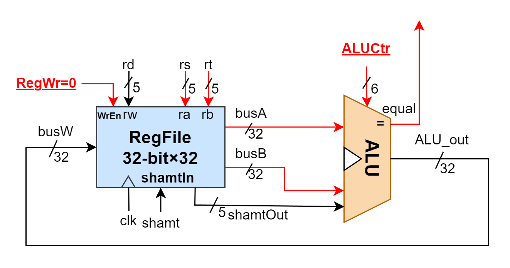

<center>[图3.2.2.4-跳转指令通用数据通路-2]</center>

##### 3.2.2.5 分析I型指令ADDI

**(1)ADDI的操作：**

-   R[rt]<-R[rs]+SignExt[im]
  - 将rs寄存器对应的内容和指令字低16位立即数进行有符号扩展后的数相加并存入rt对应寄存器中

**(2)设计数据通路**

如[图3.2.2.5-ADDI指令数据通路]

- IFU取指令数据通路已经满足需求
- 需要再跳转指令通用数据通路的基础上引入一个16位扩展为32位的扩展器
- 需要添加一个2选1多路复用器并引入控制信号==<u>ALUSrc</u>==来控制ALU第二个源操作数的来源
- 写入的是rt对应的寄存器，因此写入端需要引入一个2选1多路复用器和一个控制信号==<u>RegDst</u>==来选择写入的寄存器

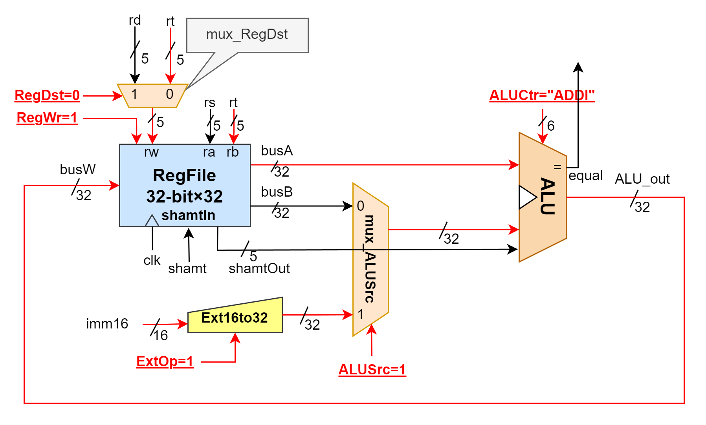

<center>[图3.2.2.5-ADDI指令数据通路]</center>

**(3)分析部件相同的指令**

**对于以下指令，需要的部件和控制信号与ADDI基本相同**

- ADDIU,SLTI,SLTIU,ANDI,ORI,XORI

##### 3.2.2.6 分析I型指令LW

**(1)LW的操作**

- R[rt]<-Mem[R[rs]+SignExt[im]]
- 将有符号扩展后的立即数和rs寄存器对应的内容相加作为地址Addr
- 引入数据存储器，同时访问数据存储器中地址位Addr的单元并取出写入rt对应的寄存器中

**(2)设计数据通路**

如[图3.2.2.6-LW指令数据通路]

- 需要引入一个数据存储器，并将ALU的输出作为输入，同时==<u>ALUCtr</u>==="ADD"执行加法操作计算地址(存储1024条数据，对应ALU_out的低10位)
- 扩展器进行有符号扩展，==<u>ExtOp</u>===1，ALU的第二个源操作数来源于扩展后的立即数，所以==<u>ALUSrc</u>===1
- RegFile写入的数据busW对应数据存储器中取出的指令而不是ALU_out，因此需要引入一个2选1多路复用器，并引入一个控制信号==<u>MemtoReg</u>==来选择写入寄存器堆的数据

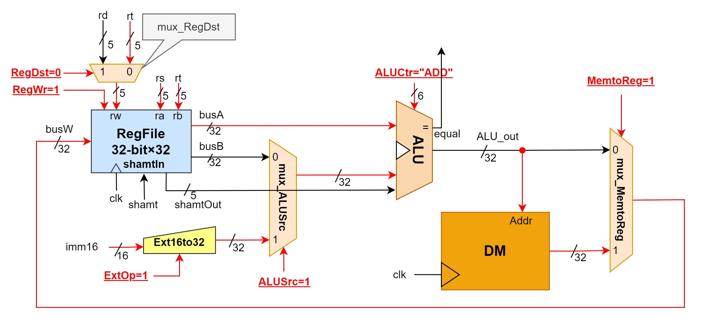

<center>[图3.2.2.6-LW指令数据通路]</center>

##### 3.2.2.7 分析SW指令

**(1)SW的操作**

- Mem[R[rs]+SignExt[im]]<-R[rt]
- 将有符号扩展后的立即数和rs寄存器对应的内容相加作为地址Addr
- 将rt寄存器对应的内容写入到数据存储器中对应Addr地址的存储单元中

**(2)设计数据通路**

如[图3.2.2.7-SW指令数据通路]

- 需要使得数据存储器可写，引入控制信号==<u>MemWr</u>==，控制数据存储器的写入
- 需要rt寄存器对应的内容，将busB送入数据存储器中

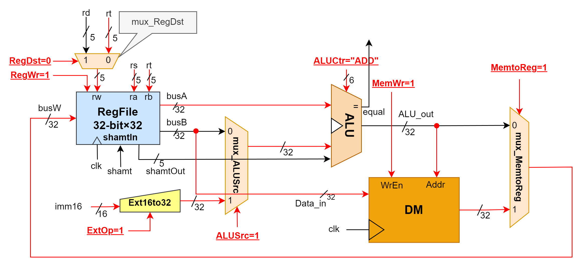

<center>[图3.2.2.7-SW指令数据通路]</center>

##### 3.2.2.8 设计控制器，集成控制信号

**(1)控制信号的逻辑表达式**

根据执行各个指令时的控制信号值列出

**R型指令**[表3.2.2.8-R型指令控制信号]

| 控制信号/指令 | ADD    | ADDU   | SUB    | SUBU   | SLT    | SLTU   | AND    | OR     | XOR    | NOR    | SLL    | SRL    | SRA    | SLLV   | SRLV   | SRAV   | JR     |
| ------------- | ------ | ------ | ------ | ------ | ------ | ------ | ------ | ------ | ------ | ------ | ------ | ------ | ------ | ------ | ------ | ------ | ------ |
| PCSrc         | 000    | 000    | 000    | 000    | 000    | 000    | 000    | 000    | 000    | 000    | 000    | 000    | 000    | 000    | 000    | 000    | 001    |
| RegDst        | 1      | 1      | 1      | 1      | 1      | 1      | 1      | 1      | 1      | 1      | 1      | 1      | 1      | 1      | 1      | 1      | x      |
| RegWr         | 1      | 1      | 1      | 1      | 1      | 1      | 1      | 1      | 1      | 1      | 1      | 1      | 1      | 1      | 1      | 1      | 0      |
| ExtOp         | x      | x      | x      | x      | x      | x      | x      | x      | x      | x      | x      | x      | x      | x      | x      | x      | x      |
| ALUSrc        | 0      | 0      | 0      | 0      | 0      | 0      | 0      | 0      | 0      | 0      | 0      | 0      | 0      | 0      | 0      | 0      | x      |
| ALUCtr        | 100000 | 100001 | 100010 | 100011 | 101010 | 101011 | 100100 | 100101 | 100110 | 100111 | 000000 | 000010 | 000011 | 000100 | 000110 | 000111 | 001000 |
| MemWr         | 0      | 0      | 0      | 0      | 0      | 0      | 0      | 0      | 0      | 0      | 0      | 0      | 0      | 0      | 0      | 0      | 0      |
| MemtoReg      | 0      | 0      | 0      | 0      | 0      | 0      | 0      | 0      | 0      | 0      | 0      | 0      | 0      | 0      | 0      | 0      | 0      |

<center>[表3.2.2.8-R型指令]</center>

**I型指令**[表3.2.2.8-I型指令控制信号]

| 控制信号/指令 | ADDI   | ADDIU  | SLTI   | SLTIU  | ANDI   | ORI    | XORI   | LW     | SW     | BEQ           | BNE            |
| ------------- | ------ | ------ | ------ | ------ | ------ | ------ | ------ | ------ | ------ | ------------- | -------------- |
| PCSrc         | 000    | 000    | 000    | 000    | 000    | 000    | 000    | 000    | 000    | equal?010:000 | !equal?011:000 |
| RegDst        | 0      | 0      | 0      | 0      | 0      | 0      | 0      | 0      | x      | x             | x              |
| RegWr         | 1      | 1      | 1      | 1      | 1      | 1      | 1      | 1      | 0      | 0             | 0              |
| ExtOp         | 1      | 0      | 1      | 0      | 0      | 0      | 0      | 1      | 1      | x             | x              |
| ALUSrc        | 1      | 1      | 1      | 1      | 1      | 1      | 1      | 1      | 1      | x             | x              |
| ALUCtr        | 001000 | 001001 | 001010 | 001011 | 001100 | 001101 | 001110 | 100011 | 101011 | 000100        | 000101         |
| MemWr         | 0      | 0      | 0      | 0      | 0      | 0      | 0      | 0      | 1      | 0             | 0              |
| MemtoReg      | 0      | 0      | 0      | 0      | 0      | 0      | 0      | 1      | x      | x             | x              |

<center>[表3.2.2.8-I型指令控制信号]</center>

**J型指令**[表3.2.2.8-J型指令控制信号]

| 控制信号/指令 | J      |
| ------------- | ------ |
| PCSrc         | 100    |
| RegDst        | x      |
| RegWr         | 0      |
| ExtOp         | x      |
| ALUSrc        | x      |
| ALUCtr        | 000010 |
| MemWr         | 0      |
| MemtoReg      | x      |

<center>[表3.2.2.8-J型指令控制信号]</center>

**(2)设计控制器**

控制器集成了所有的控制信号，根据输入的op，funct，equal信号进行输出，如[图3.2.2.8-控制器]

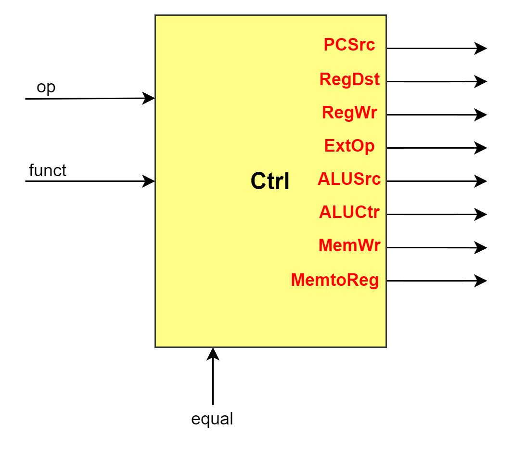

<center>[图3.2.2.8-控制器]</center>


##### 3.2.2.9 分析总结

总结所有的数据通路和部件，如[图3.2.2.9-分析总结]

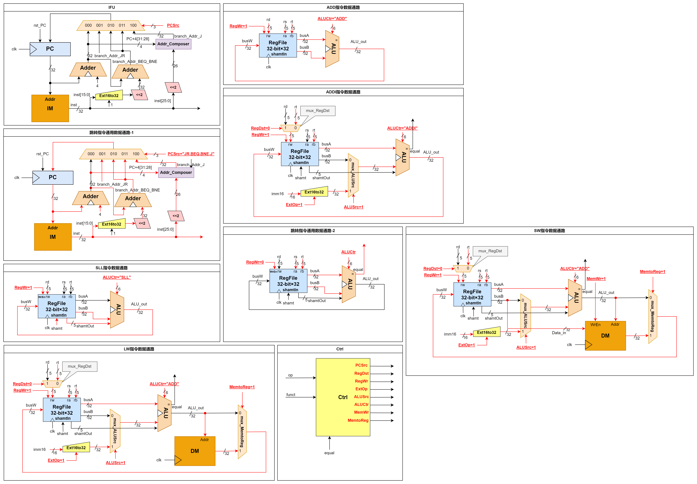

<center>[图3.2.2.9-分析总结]</center>

### 3.3 总体数据通路和部件

1. **最终部件和数据通路**

通过分析所有指令的需求，得到了最终部件和数据通路，如[图3.3-最终部件和数据通路]

- **核心部件**
  - **PC**
  - **IM**
  - **RegFile**
  - **Ext16to32**
  - **DM**
  - **ALU**
  - **Ctrl**
- **扩展部件**
  - **Addr_Composer**
    - 地址拼接器
    - 用于将PC+4的高四位与左移后的指令字的低26位拼接
  - **mux_RegDst**
    - 2选1多路复用器
    - 用于选择寄存器堆写入的寄存器
  - **mux_ALUSrc**
    - 2选1多路复用器
    - 决定ALU第二个源操作数src2的来源
  - **mux_MemtoReg**
    - 2选1多路复用器
    - 决定写入寄存器的值的来源

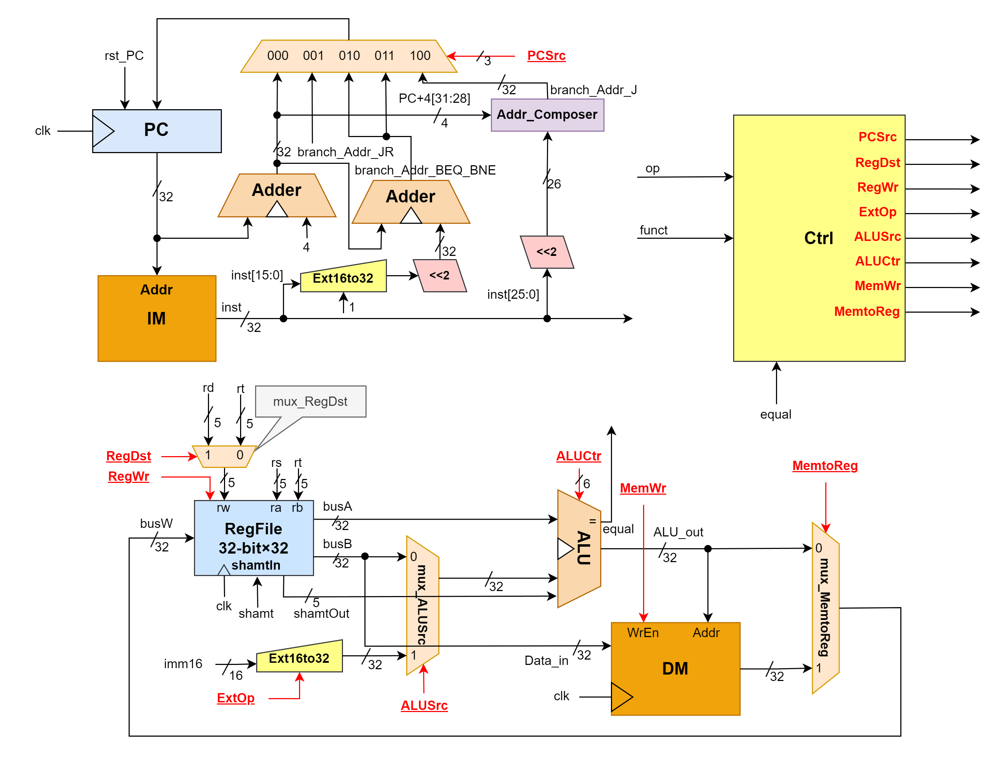

<center>[图3.3-最终部件和数据通路]</center>

2. **连接部件得到处理器总体数据通路**

连接所有的部件，得到总体的数据通路，如[图3.3-总体数据通路]

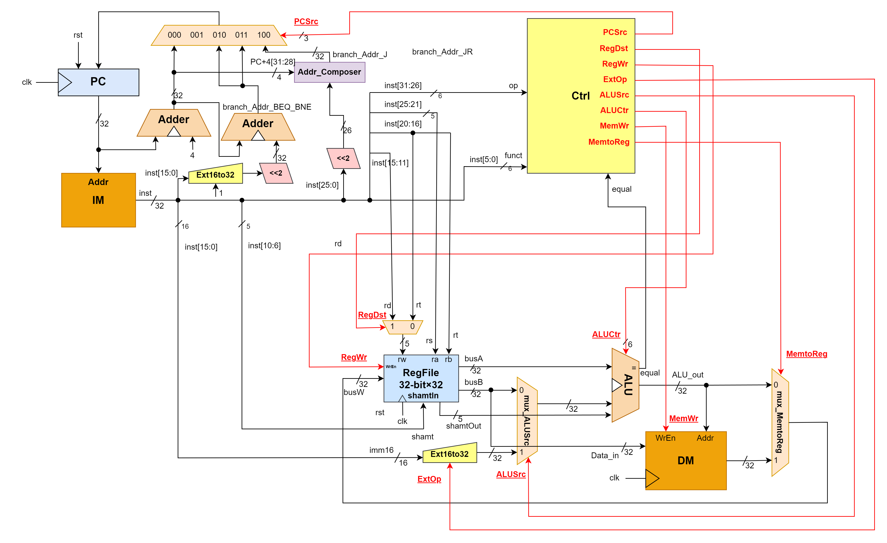

<center>[图3.3-总体数据通路]</center>


3. **编写代码并连接各个模块**

**代码目录：**[图3.3-代码目录]

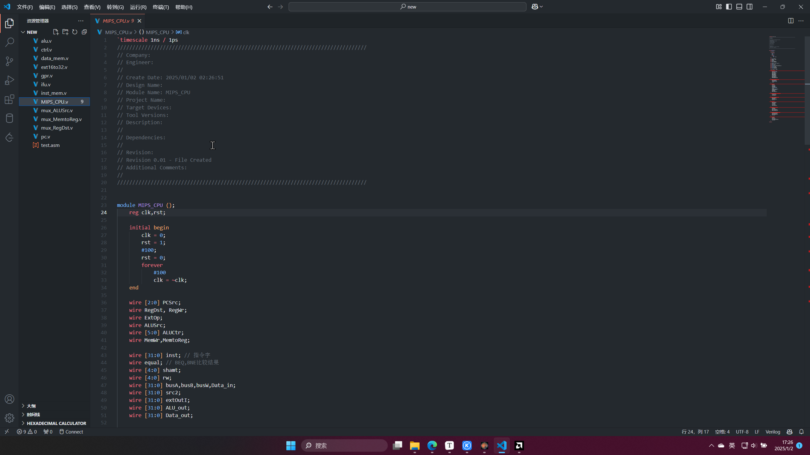

<center>[图3.3-代码目录]</center>

**核心代码：**

```verilog
`timescale 1ns / 1ps
//////////////////////////////////////////////////////////////////////////////////
// Company: 
// Engineer: 
// 
// Create Date: 2025/01/02 02:26:51
// Design Name: 
// Module Name: MIPS_CPU
// Project Name: 
// Target Devices: 
// Tool Versions: 
// Description: 
// 
// Dependencies: 
// 
// Revision:
// Revision 0.01 - File Created
// Additional Comments:
// 
//////////////////////////////////////////////////////////////////////////////////


module MIPS_CPU ();
    reg clk,rst;

    initial begin
        clk = 0;
        rst = 1;
        #100;
        rst = 0;
        forever
            #100
            clk = ~clk;
    end

    wire [2:0] PCSrc;
    wire RegDst, RegWr;
    wire ExtOp;
    wire ALUSrc;
    wire [5:0] ALUCtr;
    wire MemWr,MemtoReg;

    wire [31:0] inst; // 指令字
    wire equal; // BEQ,BNE比较结果
    wire [4:0] shamt;
    wire [4:0] rw;
    wire [31:0] busA,busB,busW,Data_in;
    wire [31:0] src2;
    wire [31:0] extOutI;
    wire [31:0] ALU_out;
    wire [31:0] Data_out;

    assign Data_in = busB;

    ctrl ctrl_inst(
        .op(inst[31:26]),
        .funct(inst[5:0]),
        .equal(equal),
        .PCSrc(PCSrc),
        .RegDst(RegDst),
        .RegWr(RegWr),
        .ExtOp(ExtOp),
        .ALUSrc(ALUSrc),
        .ALUCtr(ALUCtr),
        .MemWr(MemWr),
        .MemtoReg(MemtoReg)
    );

    mux_RegDst mux_RegDst_inst(
        .RegDst(RegDst),
        .rt(inst[20:16]),
        .rd(inst[15:11]),
        .rw(rw)
    );

    gpr gpr_inst(
        .clk(clk),
        .rst(rst),
        .WrEn(RegWr),
        .busW(busW),
        .ra(inst[25:21]),
        .rb(inst[20:16]),
        .rw(rw),
        .shamtIn(inst[10:6]),
        .shamtOut(shamt),
        .busA(busA),
        .busB(busB),
        .Data_in(Data_in)
    );

    ext16to32 ext16to32_inst_ALUSrc(
        .ExtOp(ExtOp),
        .in(inst[15:0]),
        .out(extOutI)
    );

    mux_ALUSrc mux_ALUSrc_inst(
        .ALUSrc(ALUSrc),
        .busB(busB),
        .extOut(extOutI),
        .out(src2)
    );

    alu alu_inst(
        .ALUCtr(ALUCtr),
        .shamt(shamt),
        .src1(busA),
        .src2(src2),
        .equal(equal),
        .ALU_out(ALU_out)
    );

    data_mem data_mem_inst(
        .clk(clk),
        .WrEn(MemWr),
        .Data_in(Data_in),
        .Addr(ALU_out[9:0]),
        .Data_out(Data_out)
    );

    mux_MemtoReg mux_MemtoReg_inst(
        .MemtoReg(MemtoReg),
        .ALU_out(ALU_out),
        .Data_out(Data_out),
        .busW(busW)
    );

    ifu ifu_inst(
        .clk(clk),
        .rst(rst),
        .PCSrc(PCSrc),
        .branch_Addr_JR(busA),
        .inst(inst)
    );

endmodule
```

各个模块的代码置于附录

## 4. 系统测试

### 4.1 指令功能测试

- **编写汇编语言代码，预测结果**
- **使用MARS将汇编语言转为十六进制**
- **使用vivado进行仿真测试**

#### 4.1.1 R型指令功能测试

1. **编写汇编语言代码，预测结果**

- 代码

  ```assembly
  # 初始化寄存器
  addi $gp, $zero, 6 # 预测结果：regi[28] = 00000006
  addi $sp, $zero, 5 # 预测结果：regi[29] = 00000005
  addi $fp, $zero, 2 # 预测结果：regi[30] = 00000002
  addi $ra, $zero, 4 # 预测结果：regi[31] = 00000004
  
  # ADD,ADDU,SUB,SUBU
  add $at, $gp, $sp # 预测结果：regi[1] = 0000000B
  addu $v0, $gp, $sp # 预测结果：regi[2] = 0000000B
  sub $v1, $gp, $sp # 预测结果：regi[3] = 00000001
  subu $a0, $gp, $sp # 预测结果：regi[4] = 00000001
  # SLT,SLTU
  slt $a1, $gp, $sp # 预测结果：regi[5] = 00000000
  sltu $a2, $fp, $ra # 预测结果：regi[6] = 00000001
  # AND,OR,XOR,NOR
  and $a3, $gp, $sp # 预测结果：regi[7] = 00000004
  or $t0, $gp, $sp # 预测结果：regi[8] = 00000007
  xor $t1, $gp, $sp # 预测结果：regi[9] = 00000003
  nor $t2, $gp, $sp # 预测结果：regi[10] = FFFFFFF8
  # SLL,SRL,SRA
  sll $t3, $gp, 2 # 预测结果：regi[11] = 00000018
  srl $t4, $gp, 2 # 预测结果：regi[12] = 00000001
  sra $t5, $gp, 2 # 预测结果：regi[13] = 00000001
  # SLLV,SRLV,SRAV
  sllv $t6, $gp, $sp # 预测结果：regi[14] = 000000c0
  srlv $t7, $gp, $sp # 预测结果：regi[15] = 00000000
  srav $s0, $gp, $sp # 预测结果：regi[16] = 00000000
  # JR
  jr $ra # 预测结果：PC = 00000004
  ```

- 指令解释：
  - 首先利用addi指令将恒为0的寄存器zero与立即数6，5，2，4分别相加放入28,29,30,31寄存器进行初始化
  - 然后执行各个测试指令，对28，29，30，31的内容进行操作并按从1号寄存器开始存放结果
    - `add $at, $gp, $sp`：将gp寄存器的内容与sp寄存器的内容存入at寄存器中，对应寄存器堆的1号寄存器
    - 诸如以上的指令测试

- 预测结果，如[图4.1.1-R型指令预测结果]

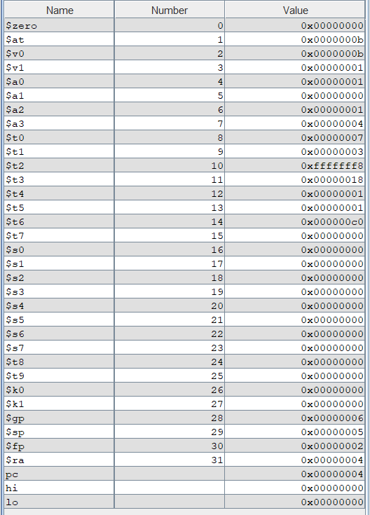

<center>[图4.1.1-R型指令预测结果]</center>

2. **使用MARS将汇编语言转为十六进制**

3. **使用vivado进行仿真测试**

- 观察[图4.1.1-R型指令测试仿真图]
- 观察寄存器堆和pc的内容
  - `addi $gp, $zero, 6`：将立即数6加到寄存器28，结果：reg[28] = 6。

  - `addi $sp, $zero, 5`：将立即数5加到寄存器29，结果：reg[29] = 5。

  - `addi $fp, $zero, 2`：将立即数2加到寄存器30，结果：reg[30] = 2。

  - `addi $ra, $zero, 4`：将立即数4加到寄存器31，结果：reg[31] = 4。

  - `add $at, $gp, $sp`：将寄存器28和寄存器29的值相加，结果：reg[1] = 11。

  - `addu $v0, $gp, $sp`：将寄存器28和寄存器29的值相加，结果：reg[2] = 11。

  - `sub $v1, $gp, $sp`：将寄存器29的值从寄存器28中减去，结果：reg[3] = 1。

  - `subu $a0, $gp, $sp`：将寄存器29的值从寄存器28中减去，结果：reg[4] = 1。

  - `slt $a1, $gp, $sp`：比较寄存器28和寄存器29，如果28小于29，则reg[5] = 1，否则为0。

  - `sltu $a2, $fp, $ra`：比较寄存器30和寄存器31，如果30小于31，则reg[6] = 1，否则为0。

  - `and $a3, $gp, $sp`：将寄存器28和寄存器29进行逻辑与操作，结果：reg[7] = 4。

  - `or $t0, $gp, $sp`：将寄存器28和寄存器29进行逻辑或操作，结果：reg[8] = 7。

  - `xor $t1, $gp, $sp`：将寄存器28和寄存器29进行逻辑异或操作，结果：reg[9] = 3。

  - `nor $t2, $gp, $sp`：对寄存器28和寄存器29进行逻辑或操作后取反，结果：reg[10] = FFFFFFF8。

  - `sll $t3, $gp, 2`：将寄存器28的值左移2位，结果：reg[11] = 18。

  - `srl $t4, $gp, 2`：将寄存器28的值右移2位，结果：reg[12] = 1。

  - `sra $t5, $gp, 2`：将寄存器28的值算术右移2位，结果：reg[13] = 1。

  - `sllv $t6, $gp, $sp`：将寄存器28的值左移寄存器29的值位，结果：reg[14] = 60。

  - `srlv $t7, $gp, $sp`：将寄存器28的值右移寄存器29的值位，结果：reg[15] = 0。

  - `srav $s0, $gp, $sp`：将寄存器28的值算术右移寄存器29的值位，结果：reg[16] = 0。

  - `jr $ra`：跳转到寄存器31的值，结果：PC = 4。

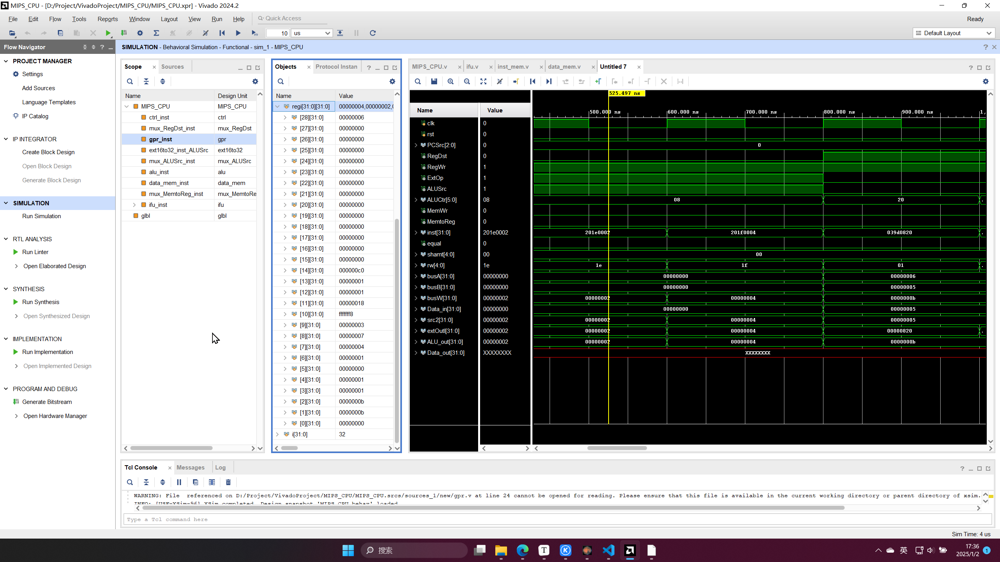

<center>[图4.1.1-R型指令测试仿真图]</center>

#### 4.1.2 I型和J型指令功能测试

1. **编写汇编语言代码，预测结果**

- 代码

  ```assembly
  # 初始化寄存器
  addi $k1, $zero, 2 # 预测结果：regi[27] = 00000002
  addi $gp, $zero, 6 # 预测结果：regi[28] = 00000006
  addi $sp, $zero, 5 # 预测结果：regi[29] = 00000005
  addi $fp, $zero, 2 # 预测结果：regi[30] = 00000002
  addi $ra, $zero, 4 # 预测结果：regi[31] = 00000004
  
  BNE_TO_J:
  bne $k1, $fp, J
  
  # ADDI,ADDIU,SLTI,SLTIU
  addi $at, $gp, 1 # 预测结果：regi[1] = 00000001
  addiu $v0, $sp, 2 # 预测结果：regi[2] = 00000007
  slti $v1, $fp, 3 # 预测结果：regi[3] = 00000001
  sltiu $a0, $ra, 5 # 预测结果：regi[4] = 00000001
  # ANDI,ORI,XORI
  andi $a1, $at, 4 # 预测结果：regi[5] = 00000004
  ori $a2, $v0, 5 # 预测结果：regi[6] = 00000007
  xori $a3, $v1, 6 # 预测结果：regi[7] = 00000007
  # SW,LW
  sw $gp, 0($zero) # 预测结果：mem[0] = 00000006
  lw $t0, 0($zero) # 预测结果：regi[8] = 00000006
  addi $fp, $zero, 1 # 预测结果：regi[30] = 00000001，为跳转作准备
  # BEQ,BNE,J
  beq $a1, $ra, BNE_TO_J
  J:
  j J # 预测会进入死循环
  ```

- 指令解释
  
  - `addi 27, 0, 2`：将数值2加载到寄存器27，结果：reg[27] = 2。
  
  - `addi 28, 0, 6`：将数值6加载到寄存器28，结果：reg[28] = 6。
  
  - `addi 29, 0, 5`：将数值5加载到寄存器29，结果：reg[29] = 5。
  
  - `addi 30, 0, 2`：将数值2加载到寄存器30，结果：reg[30] = 2。
  
  - `addi 31, 0, 4`：将数值4加载到寄存器31，结果：reg[31] = 4。
  
  - `bne 27, 30, J`：如果寄存器27不等于寄存器30，则跳转到标签J，结果：可能跳转，如果27!=30。
  
  - `addi 1, 28, 1`：将寄存器28的值加1，结果存储在寄存器1，结果：reg[1] = reg[28] + 1。
  
  - `addiu 2, 29, 2`：将寄存器29的值加2，结果存储在寄存器2，结果：reg[2] = reg[29] + 2。
  
  - `slti 3, 30, 3`：如果寄存器30的值小于3，则寄存器3设为1，否则为0，结果：reg[3] = (reg[30] < 3) ? 1 : 0。
  
  - `sltiu 4, 31, 5`：如果寄存器31的值小于5，则寄存器4设为1，否则为0，结果：reg[4] = (reg[31] < 5) ? 1 : 0。
  
  - `andi 5, 1, 4`：将寄存器1的值与4进行逻辑与，结果存储在寄存器5，结果：reg[5] = reg[1] & 4。
  
  - `ori 6, 2, 5`：将寄存器2的值与5进行逻辑或，结果存储在寄存器6，结果：reg[6] = reg[2] | 5。
  
  - `xori 7, 3, 6`：将寄存器3的值与6进行逻辑异或，结果存储在寄存器7，结果：reg[7] = reg[3] ^ 6。
  
  - `sw 28, 0(0)`：将寄存器28的值存储到内存地址0，结果：mem[0] = reg[28]。
  
  - `lw 8, 0(0)`：从内存地址0加载一个字到寄存器8，结果：reg[8] = mem[0]。
  
  - `addi 30, 0, 1`：将数值1加载到寄存器30，结果：reg[30] = 3。
  
  - `beq 5, 31, BNE_TO_J`：如果寄存器5等于寄存器31，则跳转到标签BNE_TO_J，结果：可能跳转，如果5==31。
  
  - `j J`：无条件跳转到标签J，结果：进入死循环。
- 预测结果如上

2. **使用MARS将汇编语言转为十六进制**

3. **使用vivado进行仿真测试**

仿真测试结果[图4.1.2-I型和J型指令测试仿真图]和[图4.1.2-数据存储器单元图]

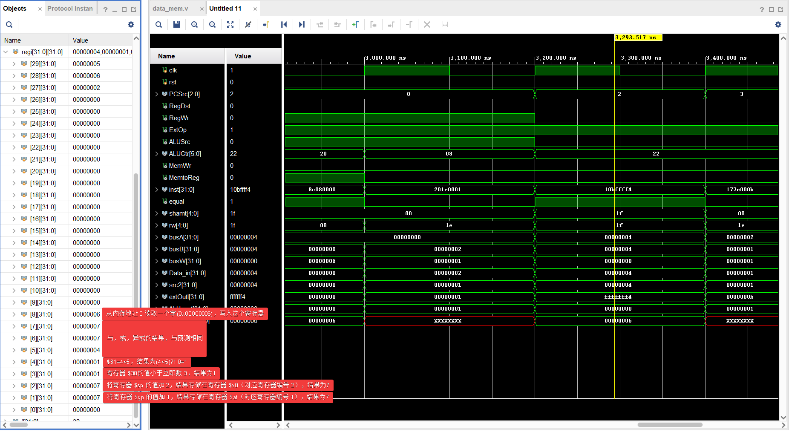

<center>[图4.1.2-I型和J型指令测试仿真图]</center>

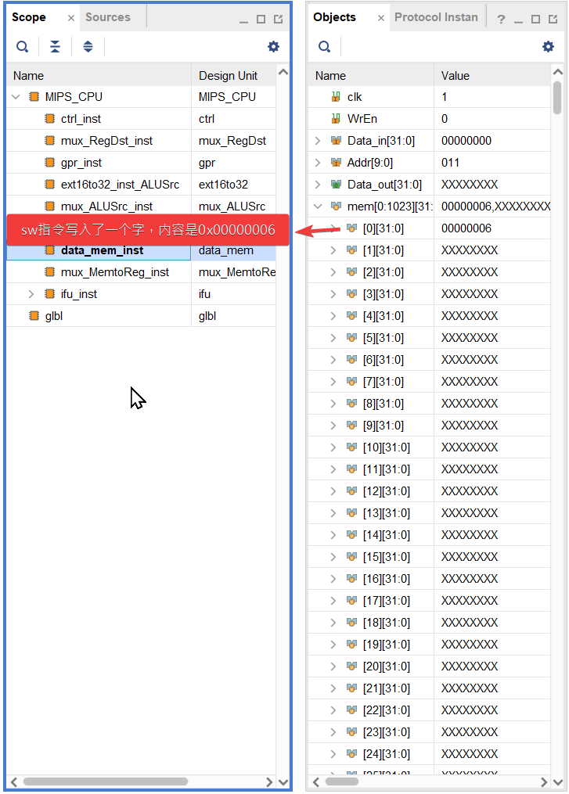

<center>[图4.1.2-数据存储器单元图]</center>

4. **分析仿真图关键节点**

1. 执行SW指令时，如[图4.1.2-SW指令分析]

- 可以看到对应的inst[31:0]=32'hac1c0000是汇编指令中的`sw $gp, 0($zero)`
- Data_in表示需要写入的值，对应gp寄存器的内容
- ALU_out的低10位表示zero寄存器对应的数据存储单元的地址

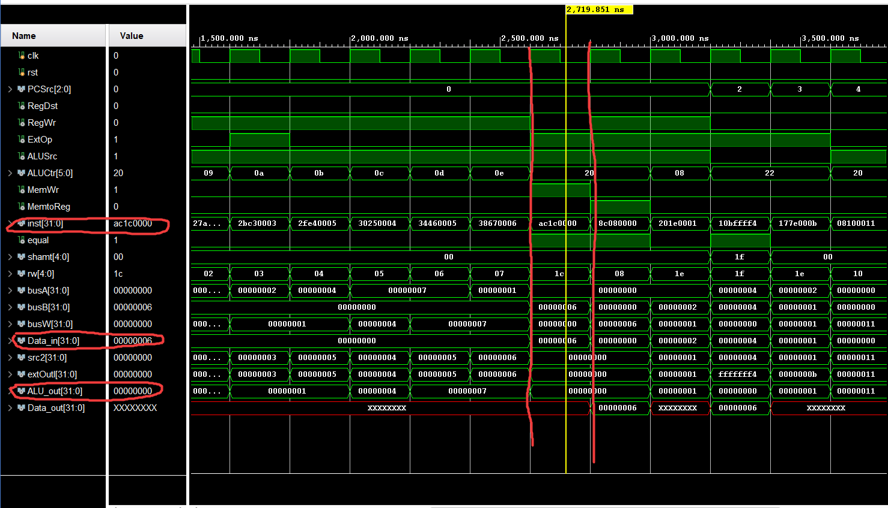

<center>[图4.1.2-SW指令分析]</center>

2. 执行LW指令时，如[图4.1.2-LW指令分析]

- 可以看到对应的inst[31:0]=32'h8c080000是汇编指令中的`lw $t0, 0($zero) # 预测结果：regi[8] = 00000006`
- Data_out表示从数据存储器地址为zero对应的内容的单元中成功取出了0x0000006并输出
- busW表示Data_out被送入寄存器中

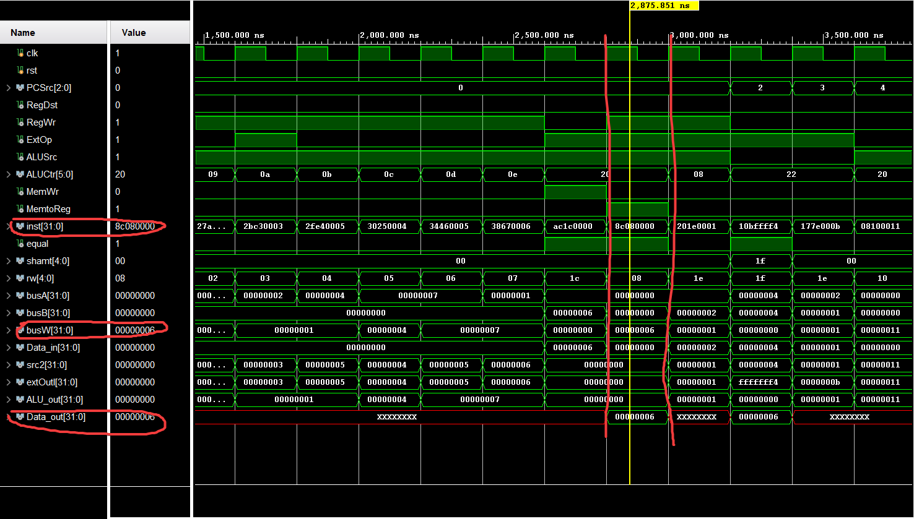

3. 接下来是跳转指令beq，bne和j，如[图4.1.2-BEQ,BNE和J指令分析]

- 可以看到执行的指令顺序是：`beq $a1, $ra, BNE_TO_J`->`bne $k1, $fp, J`->`j J`->`j J`->死循环
  - 由于寄存器a1的内容与ra相同，故执行beq指令跳转到BNE_TO_J标签
  - 由于寄存器k1的内容与fp不相同，故执行bne指令跳转到J标签
  - 执行j指令无条件跳转到J标签，进入死循环


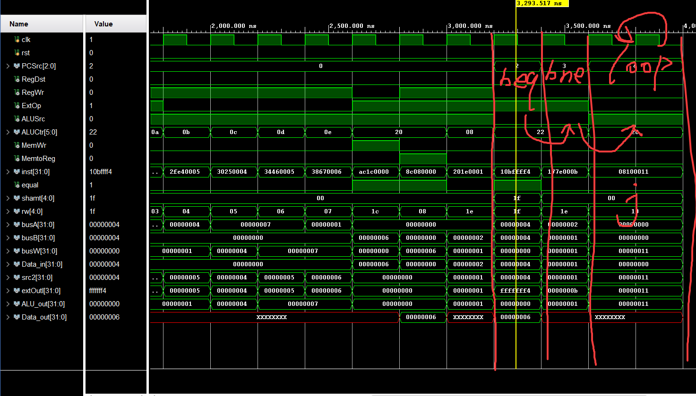

<center>[图4.1.2-BEQ,BNE和J指令分析]</center>

### 4.2 使用MIPS_CPU实现冒泡排序

#### 4.2.1 编写汇编代码，初始化MIPS_CPU

1. **使用实现的指令编写冒泡排序汇编代码**

**汇编代码**

```assembly
# bubbleSort

init: # 初始化寄存器
    addi $v0, $zero, 100 # 外循环最大次数
    addi $v1, $zero, 100 # 内循环最大次数
    addi $a0, $zero, 0 # 外循环进行的下标i
    addi $a1, $zero, 0 # 内循环进行的下标j
    addi $t0, $zero, 0 # 临时变量array[i]
    addi $t1, $zero, 0 # 临时变量array[j]
    addi $t2, $zero, 0 # 临时变量temp，用于交换
    addi $t3, $zero, 0 # 临时变量cmp，用于存储比较结果
    addi $k0, $zero, 0 # 临时变量，用于存储下标i与外循环最大次数比较的结果
    addi $k1, $zero, 0 # 临时变量，用于存储下标j与内循环最大次数比较的结果

# 外层循环
out_loop:
# 读取数据存储器中的array[i]
    lw $t0, 0($a0) # 读取数据存储器中的array[i]
# 内层循环
inter_loop:
    addi $a1, $a0, 0 # j = i
# j++
j_increment:
    addi $a1, $a1, 1 # j++
    # 检测j是否超出范围
    slt $k1, $a1, $v1 # 比较j和内循环最大次数，比较结果存入k1寄存器
    beq $k1, $zero, i_increment # 如果$k1=0，说明j>=内循环最大次数，跳出内循环
    # 执行比较和交换
    lw $t1, 0($a1) # 读取数据存储器中的array[j]
    slt $t3, $t1, $t0 # ($t1<$t0)?1:0 比较array[i]和array[j]，结果存入t3
    beq $t3, $zero, j_increment # 如果$t3=0，说明array[j]>=array[i]，此时跳出内循环，否则执行交换
    addi $t2, $t0, 0 # 将array[i]写入临时变量temp
    addi $t0, $t1, 0 # 将array[j]写入array[i]
    addi $t1, $t2, 0 # 取回临时变量temp中的array[i]，写入array[j]
    sw $t1, 0($a1) # 将新的array[j]写入对应的数据存储器单元中
    j j_increment # 继续执行内循环

# i++
i_increment: # 24
    # 将新的array[i]写入对应的数据存储器单元中
    sw $t0, 0($a0)
    addi $a0, $a0, 1 # i++
    # 检测i是否超出范围
    slt $k0, $a0, $v0 # 比较i和外循环最大次数，比较结果存入k0寄存器
    beq $k0, $zero, end # 如果$k0=0，说明i>=外循环最大次数，跳出外循环，程序结束
    j out_loop # 否则重新执行外循环

end: # 排序结束
    j end
```

**代码解释**

- 初始化寄存器

- `addi 2, 0, 100`：`$v0`（寄存器28）初始化为100，外循环次数。
- `addi 3, 0, 100`：`$v1`（寄存器29）初始化为100，内循环次数。
- `addi 4, 0, 0`：`$a0`（寄存器4）初始化为0，外循环下标。
- `addi 5, 0, 0`：`$a1`（寄存器5）初始化为0，内循环下标。
- `addi 6, 0, 0`：`$t0`（寄存器6）初始化为0，用于临时存储数组元素。
- `addi 7, 0, 0`：`$t1`（寄存器7）初始化为0，用于临时存储数组元素。
- `addi 8, 0, 0`：`$t2`（寄存器8）初始化为0，用于交换时的临时存储。
- `addi 9, 0, 0`：`$t3`（寄存器9）初始化为0，用于比较结果。
- `addi 10, 0, 0`：`$k0`（寄存器10）初始化为0，用于外循环条件。
- `addi 11, 0, 0`：`$k1`（寄存器11）初始化为0，用于内循环条件。

- 外层循环（寄存器4作为循环计数器）

- `lw 6, 0(4)`：从数据存储器加载数组[`$a0`]到`$t0`。

- 内层循环（寄存器5作为循环计数器）

- `addi 5, 4, 0`：设置`$a1`为`$a0`的值，即内循环开始于外循环当前位置。
- `addi 5, 5, 1`：`$a1`自增1，内循环计数。
- `slt 11, 5, 3`：如果`$a1`大于等于内循环次数，则跳过本次内循环。
- `beq 11, 0, 24`：如果`$k1`为0，跳转到外循环递增（`i_increment`）。
- `lw 7, 0(5)`：加载数组[`$a1`]到`$t1`。
- `slt 9, 7, 6`：比较数组[`$a1`]和数组[`$a0`]。
- `beq 9, 0, 28`：如果数组[`$a1`]不小于数组[`$a0`]，则跳过交换。
- `addi 8, 6, 0`：将数组[`$a0`]的值存入`$t2`。
- `addi 6, 7, 0`：将数组[`$a1`]的值存入数组[`$a0`]。
- `addi 7, 8, 0`：将`$t2`的值存入数组[`$a1`]。
- `sw 7, 0(5)`：将新值写回数据存储器。

- 外层循环递增

- `sw 6, 0(4)`：将`$t0`的值写回数据存储器。
- `addi 4, 4, 1`：外循环计数器`$a0`自增1。
- `slt 10, 4, 2`：如果`$a0`大于等于外循环次数，则结束。
- `beq 10, 0, 36`：如果`$k0`为0，跳转到结束标签（`end`）。
- `j 12`：继续外循环。

- 结束

- `j 36`：跳转到结束标签，程序结束，进入死循环，此时数据存储器中的数是排好序的数。

2. **将汇编代码转换为16进制数，使用`$readmemh`[^3]载入指令存储器中**

3. **使用`$readmemh`向数据存储器中载入100个随机的数，源数据置于附录**

#### 4.2.2 开始仿真测试，观察结果

1. **观察数据存储器[图4.2.2-冒泡排序结果]，发现100个数由小到大排序**


<center>[图4.2.2-冒泡排序结果]</center>

2. **观察仿真图，如[图4.2.2-冒泡排序仿真图]，发现最后是死循环，并且指令都正常执行，说明排序确实已经完成**

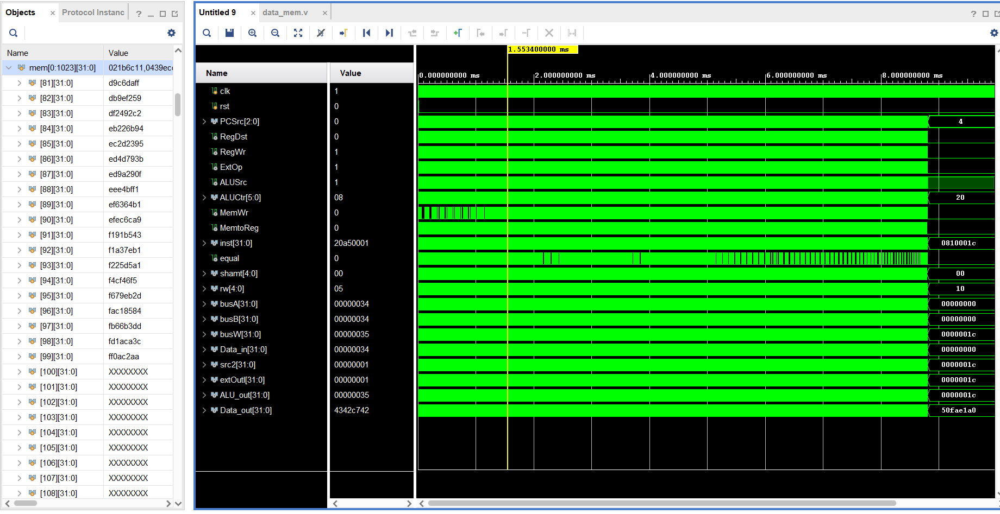

<center>[图4.2.2-冒泡排序仿真图]</center>

## 5. 实训总结与心得

### 实训心得

在本次实训中，我深入学习并实践了 MIPS 架构的单周期 CPU 设计。通过从指令系统的选取到数据通路的设计，再到控制信号的生成，我不仅加深了对计算机组成原理的理解，而且提升了自己的硬件描述语言（Verilog HDL）编程能力。

#### 学习收获

1. **指令集理解**：通过对 MIPS 指令集的学习和指令格式的分析，我掌握了 R 型、I 型和 J 型指令的特点和功能，这为我设计 CPU 的指令解码器打下了坚实的基础。
2. **硬件设计**：在设计数据通路和部件时，我学会了如何根据指令功能来设计功能部件，如 ALU、寄存器堆和数据存储器，并理解了它们如何协同工作。
3. **编程技能**：通过编写 Verilog 代码实现 CPU 的各个模块，我的编程技能得到了锻炼。我学会了如何使用 Verilog 进行模块化设计，以及如何通过测试平台验证我的设计。
4. **问题解决**：在实训过程中，我遇到了多个挑战，如指令解码的复杂性、数据通路的优化等。通过查阅资料、与同伴讨论和不断尝试，我解决了这些问题，这个过程极大地提升了我的问题解决能力。

## 6. 附录

### 6.1 Verilog 代码

#### 6.1.1 PC模块

```verilog
module pc (
    input clk,
    input rst,
    input [31:0] pc_next,
    output reg [31:0] pc // 程序计数器
);
    // 初始化PC的值
    initial begin
        pc = 32'h0000_0000;
    end

    always @(posedge clk or negedge rst) begin
        if (!rst) begin
            pc <= 32'h0000_0000;
        end else begin
            pc <= pc_next;
        end
    end
endmodule
```

#### 6.1.2 通用寄存器堆(gpr)

```verilog
module gpr (
    input clk,rst,
    input WrEn,  // 写入控制信号，RegWr=1时允许写入
    input [31:0] busW,
    input [4:0] ra,rb,rw,shamtIn,
    output [4:0] shamtOut,
    output [31:0] busA,busB,Data_in
);
    assign shamtOut = shamtIn;
    reg [31:0] regi [31:0]; // 32个寄存器，对应5位

    // 复位
    integer i;
    always @(negedge rst) begin
        if (!rst) begin
            for (i=0;i<32;i=i+1)
                regi[i]=0;
        end
    end

    // 设置 busA 和 busB
    assign busA = regi[ra];
    assign busB = regi[rb];
    assign Data_in = busB;

    // 写入控制
    always @(posedge clk) begin
        if (WrEn) begin
            regi[rw] <= busW;
            regi[0]<=0; // 保持寄存器0始终为0
        end
    end
endmodule
```

#### 6.1.3 取指令模块(IFU[^4])

```verilog
module ifu(
    input clk, // 时钟信号
    input rst, // 复位信号
    input [2:0] PCSrc,
    input [31:0] branch_Addr_JR, // JR指令对应的分支地址，直接来源于R[rs]
    output wire [31:0] inst
);
    reg [31:0] pc_next;
    wire [31:0] pc_new;
    wire [31:0] pc_newAdd4;
    // BEQ和BNE指令对应的分支地址，由指令低16位有符号扩展为32位并左移两位加上PC+4得到
    wire [31:0] branch_Addr_BEQ_BNE;
    // J指令对应的分支地址，由指令低26位左移两位后作为低26位与PC+4后的高4位拼接得到
    wire [31:0] branch_Addr_J;
    wire [31:0] extimm16;
    wire [31:0] leftShift_extimm16,leftShift_imm26;
    pc pc_inst(clk,rst_PC,pc_next,pc_new);
    assign pc_newAdd4 = pc_new + 4;
    ext16to32 ext16to32_inst(1'b1,inst[15:0],extimm16); // 有符号扩展成32位
    assign leftShift_extimm16 = extimm16<<2;
    assign leftShift_imm26 = inst[25:0]<<2;
    assign branch_Addr_BEQ_BNE = leftShift_extimm16 + pc_newAdd4;
    assign branch_Addr_J = {pc_newAdd4[31:28],leftShift_imm26};

    parameter PCAdd4 = 3'b000;
    parameter JR     = 3'b001;
    parameter BEQ    = 3'b010;
    parameter BNE    = 3'b011;
    parameter J      = 3'b100;

    always @(*) begin
        case (PCSrc)
            PCAdd4: begin
                pc_next <= pc_newAdd4;
            end
            JR: begin
                pc_next <= branch_Addr_JR; 
            end
            BEQ: begin
                pc_next <= branch_Addr_BEQ_BNE;
            end
            BNE: begin
                pc_next <= branch_Addr_BEQ_BNE;
            end
            J: begin
                pc_next <= branch_Addr_J;
            end
            default: begin
                pc_next <= pc_new;
            end
        endcase
    end
    // 从指令寄存器读取指令
    inst_mem inst_mem_inst(pc_new,inst);
endmodule
```

#### 6.1.4 控制器模块(Ctrl)

```verilog
module ctrl (
    input [5:0] op,
    input [5:0] funct,
    input equal,
    output reg [2:0] PCSrc,
    output reg RegDst,  // 寄存器堆写入端控制信号
    output reg RegWr,   // 寄存器堆写使能信号
    output reg ExtOp,   // 无符号和有符号扩展信号
    output reg ALUSrc,
    output reg [5:0] ALUCtr,
    output reg MemWr,   // 数据存储器写使能端
    output reg MemtoReg // 写回来源控制信号
);

    // 初始化指令
    /* @R型指令*/
    parameter ADD  = 6'b100000; // `R[rd]=R[rs]+R[rt]`
    parameter ADDU = 6'b100001; // `R[rd]=R[rs]+R[rt]`(无符号数)
    parameter SUB  = 6'b100010; // `R[rd]=R[rs]-R[rt]`
    parameter SUBU = 6'b100011; // `R[rd]=R[rs]-R[rt]`(无符号数)
    parameter SLT  = 6'b101010; // `R[rd]=(R[rs]<R[rt])?1:0`
    parameter SLTU = 6'b101011; // `R[rd]=(R[rs]<R[rt])?1:0`(无符号数)
    parameter AND  = 6'b100100; // `R[rd]=R[rs]&R[rt]`
    parameter OR   = 6'b100101; // `R[rd]=R[rs]|R[rt]`
    parameter XOR  = 6'b100110; // `R[rd]=R[rs]^R[rt]`
    parameter NOR  = 6'b100111; // `R[rd]=~(R[rs]|R[rt])`
    parameter SLL  = 6'b000000; // `R[rd]=R[rt]<<shamt`
    parameter SRL  = 6'b000010; // `R[rd]=R[rt]>>shamt`
    parameter SRA  = 6'b000011; // `R[rd]=R[rt]>>shamt`(符号位保留)
    parameter SLLV = 6'b000100; // `R[rd]=R[rt]<<R[rs]`
    parameter SRLV = 6'b000110; // `R[rd]=R[rt]>>R[rs]`
    parameter SRAV = 6'b000111; // `R[rd]=R[rt]>>R[rs]`(符号位保留)
    parameter JR  = 6'b001000; // `PC=R[rs]`
    /* @I型指令*/
    parameter ADDI  = 6'b001000; // `R[rt]=R[rs]+SignExt[im]`
    parameter ADDIU = 6'b001001; // `R[rt]=R[rs]+ZeroExt[im]`(无符号数)
    parameter SLTI  = 6'b001010; // `R[rt]=(R[rs]<SignExt[im])?1:0`
    parameter SLTIU = 6'b001011; // `R[rt]=(R[rs]<ZeroExt[im])?1:0`(无符号数)
    parameter ANDI  = 6'b001100; // `R[rt]=R[rs]&ZeroExt[im]`
    parameter ORI   = 6'b001101; // `R[rt]=R[rs]|ZeroExt[im]`
    parameter XORI  = 6'b001110; // `R[rt]=R[rs]^ZeroExt[im]`
    parameter LW    = 6'b100011; // `R[rt]=Mem[R[rs]+SignExt[im]]`
    parameter SW    = 6'b101011; // `Mem[R[rs]+SignExt[im]]=R[rt]`
    parameter BEQ   = 6'b000100; // `PC=(rs==rt)?PC+4+im<<2:PC`
    parameter BNE   = 6'b000101; // `PC=(rs!=rt)?PC+4+im<<2:PC`
    /* @J型指令*/
    parameter J   = 6'b000010; // `PC={(PC+4)[31:28],address<<2}`

    always @(*) begin
        // 默认赋值
        PCSrc = 3'b000;     // PC默认自增4
        RegDst = 1;         // 默认写入R[rd]
        RegWr = 0;          // 寄存器堆默认不可写入
        ExtOp = 0;          // 默认进行无符号扩展
        ALUSrc = 0;         // ALU的第二个操作数默认来源于寄存器堆
        ALUCtr = 6'b111111; // ALU操作默认未知
        MemWr = 0;          // 数据存储器默认不写入
        MemtoReg = 0;       // 默认选择ALU_out
        if (op == 6'b0) begin // R型指令
            /* @R型指令*/
            RegWr=1;  // 除了JR都需要写入
            ALUCtr = funct; // 设置对应的ALU控制信号
            case (funct)
                ADD: begin
                    
                end
                ADDU: begin
                    
                end
                SUB: begin
                    
                end
                SUBU: begin
                    
                end
                SLT: begin
                    
                end
                SLTU: begin
                    
                end
                AND: begin
                    
                end
                OR: begin
                    
                end
                XOR: begin
                    
                end
                NOR: begin
                    
                end
                SLL: begin
                    
                end
                SRL: begin
                    
                end
                SRA: begin
                    
                end
                SLLV: begin
                    
                end
                SRLV: begin
                    
                end
                SRAV: begin
                    
                end
                JR: begin
                    PCSrc = 3'b001;
                    RegWr = 0;
                end
            endcase
        end else begin // I型和J型指令
            RegDst = 0;  // 默认写入R[rt]
            RegWr = 1;   // 除了SW,BEQ,BNE和J指令，其它指令都需要写入寄存器堆
            ALUSrc = 1;
            case (op)
                /* @I型指令*/
                ADDI: begin
                    ExtOp = 1;
                    ALUCtr = ADDI;
                end
                ADDIU: begin
                    ALUCtr = ADDIU;
                end
                SLTI: begin
                    ALUCtr = SLTI;
                    ExtOp = 1;
                end
                SLTIU: begin
                    ALUCtr = SLTIU;
                end
                ANDI: begin
                    ALUCtr = ANDI;
                end
                ORI: begin
                    ALUCtr = ORI;
                end
                XORI: begin
                    ALUCtr = XORI;
                end
                LW: begin
                    ExtOp = 1;
                    MemtoReg = 1;
                    ALUCtr = ADD;
                end
                SW: begin
                    RegWr = 0;
                    ExtOp = 1;
                    MemWr = 1;
                    ALUCtr = ADD;
                end
                BEQ: begin
                    RegWr = 0;
                    ALUCtr = SUB;
                    ExtOp = 1;
                    ALUSrc = 0;
                    if (equal) begin
                        PCSrc = 3'b010;
                    end
                end
                BNE: begin
                    RegWr = 0;
                    ExtOp = 1;
                    ALUCtr = SUB;
                    ALUSrc = 0;
                    if (!equal) begin
                        PCSrc = 3'b011;
                    end
                end
                /* @J型指令*/
                J: begin
                    RegWr = 0;
                    ALUCtr = ADD;
                    PCSrc = 3'b100;
                end
            endcase
        end
    end
endmodule
```

#### 6.1.5 数据存储器模块(DM)

```verilog
module data_mem (
    input clk,
    input WrEn,
    input [31:0] Data_in,
    input [9:0] Addr,
    output [31:0] Data_out
);

    reg [31:0] mem [0:1023];
    
    // 初始化数据存储器
    initial begin
        $readmemh("", mem);
    end

    assign Data_out = mem[Addr];

    always @(posedge clk) begin
        if (WrEn) begin // 执行SW指令时进行写入
            mem[Addr] <= Data_in;
        end
    end
endmodule
```

#### 6.1.6 指令存储器模块(IM)

```verilog
module inst_mem (
    input [31:0] Addr,
    output reg [31:0] inst
);
    reg [31:0] mem [0:1023]; // 存储1024条指令

    // 初始化指令存储器
    initial begin
        $readmemh("C:/Users/LAN/Desktop/Practice/code/test/I_Jtype_Instruction/instruction.hex", mem);
    end

    // 载入指令 
    always @(*) begin
        inst = mem[Addr[11:2]];
    end
endmodule
```

#### 6.1.7 算数逻辑单元(ALU)

```verilog
module alu (
    input [5:0] ALUCtr,
    input [4:0] shamt,
    input [31:0] src1,src2,
    output reg equal,
    output reg [31:0] ALU_out
);

    // 初始化指令
    /* @R型指令*/
    parameter ADD  = 6'b100000; // `R[rd]=R[rs]+R[rt]`
    parameter ADDU = 6'b100001; // `R[rd]=R[rs]+R[rt]`(无符号数)
    parameter SUB  = 6'b100010; // `R[rd]=R[rs]-R[rt]`
    parameter SUBU = 6'b100011; // `R[rd]=R[rs]-R[rt]`(无符号数)
    parameter SLT  = 6'b101010; // `R[rd]=(R[rs]<R[rt])?1:0`
    parameter SLTU = 6'b101011; // `R[rd]=(R[rs]<R[rt])?1:0`(无符号数)
    parameter AND  = 6'b100100; // `R[rd]=R[rs]&R[rt]`
    parameter OR   = 6'b100101; // `R[rd]=R[rs]|R[rt]`
    parameter XOR  = 6'b100110; // `R[rd]=R[rs]^R[rt]`
    parameter NOR  = 6'b100111; // `R[rd]=~(R[rs]|R[rt])`
    parameter SLL  = 6'b000000; // `R[rd]=R[rt]<<shamt`
    parameter SRL  = 6'b000010; // `R[rd]=R[rt]>>shamt`
    parameter SRA  = 6'b000011; // `R[rd]=R[rt]>>shamt`(符号位保留)
    parameter SLLV = 6'b000100; // `R[rd]=R[rt]<<R[rs]`
    parameter SRLV = 6'b000110; // `R[rd]=R[rt]>>R[rs]`
    parameter SRAV = 6'b000111; // `R[rd]=R[rt]>>R[rs]`(符号位保留)
    /* @I型指令*/
    parameter ADDI  = 6'b001000; // `R[rt]=R[rs]+SignExt[im]`
    parameter ADDIU = 6'b001001; // `R[rt]=R[rs]+ZeroExt[im]`(无符号数)
    parameter SLTI  = 6'b001010; // `R[rt]=(R[rs]<SignExt[im])?1:0`
    parameter SLTIU = 6'b001011; // `R[rt]=(R[rs]<ZeroExt[im])?1:0`(无符号数)
    parameter ANDI  = 6'b001100; // `R[rt]=R[rs]&ZeroExt[im]`
    parameter ORI   = 6'b001101; // `R[rt]=R[rs]|ZeroExt[im]`
    parameter XORI  = 6'b001110; // `R[rt]=R[rs]^ZeroExt[im]`


    always @(*) begin
        case (ALUCtr)
            /* @R型指令*/
            ADD: begin
                ALU_out = src1 + src2;
            end
            ADDU: begin
                ALU_out = src1 + src2;
            end
            SUB: begin
                ALU_out = src1 - src2;
            end
            SUBU: begin
                ALU_out = src1 - src2;
            end
            SLT: begin
                ALU_out = (src1<src2)?32'b1:32'b0;
            end
            SLTU: begin
                ALU_out = (src1<src2)?32'b1:32'b0;
            end
            AND: begin
                ALU_out = src1 & src2;
            end
            OR: begin
                ALU_out = src1 | src2;
            end
            XOR: begin
                ALU_out = src1 ^ src2;
            end
            NOR: begin
                ALU_out = ~(src1 | src2);
            end
            SLL: begin
                ALU_out = src2 << shamt;
            end
            SRL: begin
                ALU_out = src2 >> shamt;
            end
            SRA: begin
                ALU_out = src2 >>> shamt;
            end
            SLLV: begin
                ALU_out = src2 << src1[4:0];
            end
            SRLV: begin
                ALU_out = src2 >> src1[4:0];
            end
            SRAV: begin
                ALU_out = src2 >>> src1[4:0];
            end
            /* @I型指令*/
            ADDI: begin
                ALU_out = src1 + src2;
            end
            ADDIU: begin
                ALU_out = src1 + src2;
            end
            SLTI: begin
                ALU_out = (src1<src2)?32'b1:32'b0;
            end
            SLTIU: begin
                ALU_out = (src1<src2)?32'b1:32'b0;
            end
            ANDI: begin
                ALU_out = src1 & src2;
            end
            ORI: begin
                ALU_out = src1 | src2;
            end
            XORI: begin
                ALU_out = src1 ^ src2;
            end
            default: begin
                ALU_out = 32'b0;
            end
        endcase
    end
    
    always @(*) begin
            if (ALU_out == 0) begin
                equal = 1;
            end else begin
                equal = 0;
            end
        end
endmodule
```

#### 6.1.8 16位扩展为32位扩展器(支持有符号扩展和无符号扩展)

```verilog
module ext16to32(
    input ExtOp,
    input [15:0] in,
    output reg [31:0] out
);
    parameter Zero = 1'b0; // 无符号扩展
    parameter Sign = 1'b1; // 有符号扩展
    always @(*) begin
        case (ExtOp)
            Zero: begin
                out <= {{16{1'b0}}, in};
            end 
            Sign: begin
                out <= {{16{in[15]}}, in};
            end
            default: begin
                out <= 32'b0;
            end
        endcase
    end
endmodule

```

#### 6.1.9 复用器

##### 6.1.9.1 mux_ALUSrc.v

```verilog
module mux_ALUSrc (
    input ALUSrc, // ALUSrc=0时，选择busB，否则选择扩展后的32位数
    input [31:0] busB,extOut,
    output reg [31:0] out
);
    always @(*) begin
        if (ALUSrc) begin // 选择扩展后的32位数
            out <= extOut;
        end else begin // 选择busB
            out <= busB;
        end
    end
endmodule
```

##### 6.1.9.2 mux_MemtoReg.v

```verilog
module mux_MemtoReg (
    input MemtoReg,
    input [31:0] ALU_out,Data_out,
    output reg [31:0] busW
);
    always @(*) begin
        if (MemtoReg) begin
            busW <= Data_out;
        end else begin
            busW <= ALU_out;
        end
    end
endmodule
```

##### 6.1.9.3 mux_RegDst.v

```verilog
// 控制写入端
module mux_RegDst (
    input RegDst,
    input [4:0] rt,rd,
    output reg [4:0] rw
);
    always @(*) begin
        if (RegDst) begin
            rw <= rd;
        end else begin
            rw <= rt;
        end
    end
endmodule
```

#### 6.1.10 MIPS_CPU(链接所有模块)

```verilog
`timescale 1ns / 1ps
//////////////////////////////////////////////////////////////////////////////////
// Company: 
// Engineer: 
// 
// Create Date: 2025/01/02 02:26:51
// Design Name: 
// Module Name: MIPS_CPU
// Project Name: 
// Target Devices: 
// Tool Versions: 
// Description: 
// 
// Dependencies: 
// 
// Revision:
// Revision 0.01 - File Created
// Additional Comments:
// 
//////////////////////////////////////////////////////////////////////////////////

module MIPS_CPU ();
    reg clk,rst;

    initial begin
        clk = 0;
        rst = 1;
        #100;
        rst = 0;
        forever
            #100
            clk = ~clk;
    end

    wire [2:0] PCSrc;
    wire RegDst, RegWr;
    wire ExtOp;
    wire ALUSrc;
    wire [5:0] ALUCtr;
    wire MemWr,MemtoReg;

    wire [31:0] inst; // 指令字
    wire equal; // BEQ,BNE比较结果
    wire [4:0] shamt;
    wire [4:0] rw;
    wire [31:0] busA,busB,busW,Data_in;
    wire [31:0] src2;
    wire [31:0] extOutI;
    wire [31:0] ALU_out;
    wire [31:0] Data_out;

    assign Data_in = busB;

    ctrl ctrl_inst(
        .op(inst[31:26]),
        .funct(inst[5:0]),
        .equal(equal),
        .PCSrc(PCSrc),
        .RegDst(RegDst),
        .RegWr(RegWr),
        .ExtOp(ExtOp),
        .ALUSrc(ALUSrc),
        .ALUCtr(ALUCtr),
        .MemWr(MemWr),
        .MemtoReg(MemtoReg)
    );

    mux_RegDst mux_RegDst_inst(
        .RegDst(RegDst),
        .rt(inst[20:16]),
        .rd(inst[15:11]),
        .rw(rw)
    );

    gpr gpr_inst(
        .clk(clk),
        .rst(rst),
        .WrEn(RegWr),
        .busW(busW),
        .ra(inst[25:21]),
        .rb(inst[20:16]),
        .rw(rw),
        .shamtIn(inst[10:6]),
        .shamtOut(shamt),
        .busA(busA),
        .busB(busB),
        .Data_in(Data_in)
    );

    ext16to32 ext16to32_inst_ALUSrc(
        .ExtOp(ExtOp),
        .in(inst[15:0]),
        .out(extOutI)
    );

    mux_ALUSrc mux_ALUSrc_inst(
        .ALUSrc(ALUSrc),
        .busB(busB),
        .extOut(extOutI),
        .out(src2)
    );

    alu alu_inst(
        .ALUCtr(ALUCtr),
        .shamt(shamt),
        .src1(busA),
        .src2(src2),
        .equal(equal),
        .ALU_out(ALU_out)
    );

    data_mem data_mem_inst(
        .clk(clk),
        .WrEn(MemWr),
        .Data_in(Data_in),
        .Addr(ALU_out[9:0]),
        .Data_out(Data_out)
    );

    mux_MemtoReg mux_MemtoReg_inst(
        .MemtoReg(MemtoReg),
        .ALU_out(ALU_out),
        .Data_out(Data_out),
        .busW(busW)
    );

    ifu ifu_inst(
        .clk(clk),
        .rst(rst),
        .PCSrc(PCSrc),
        .branch_Addr_JR(busA),
        .inst(inst)
    );

endmodule
```

### 6.2 测试代码(汇编和十六进制)

#### 6.2.1 R型指令测试代码

**汇编代码**

```assembly
# 初始化寄存器
addi $gp, $zero, 6 # 预测结果：regi[28] = 00000006
addi $sp, $zero, 5 # 预测结果：regi[29] = 00000005
addi $fp, $zero, 2 # 预测结果：regi[30] = 00000002
addi $ra, $zero, 4 # 预测结果：regi[31] = 00000004

# ADD,ADDU,SUB,SUBU
add $at, $gp, $sp # 预测结果：regi[1] = 0000000B
addu $v0, $gp, $sp # 预测结果：regi[2] = 0000000B
sub $v1, $gp, $sp # 预测结果：regi[3] = 00000001
subu $a0, $gp, $sp # 预测结果：regi[4] = 00000001
# SLT,SLTU
slt $a1, $gp, $sp # 预测结果：regi[5] = 00000000
sltu $a2, $fp, $ra # 预测结果：regi[6] = 00000001
# AND,OR,XOR,NOR
and $a3, $gp, $sp # 预测结果：regi[7] = 00000004
or $t0, $gp, $sp # 预测结果：regi[8] = 00000007
xor $t1, $gp, $sp # 预测结果：regi[9] = 00000003
nor $t2, $gp, $sp # 预测结果：regi[10] = FFFFFFF8
# SLL,SRL,SRA
sll $t3, $gp, 2 # 预测结果：regi[11] = 00000018
srl $t4, $gp, 2 # 预测结果：regi[12] = 00000001
sra $t5, $gp, 2 # 预测结果：regi[13] = 00000001
# SLLV,SRLV,SRAV
sllv $t6, $gp, $sp # 预测结果：regi[14] = 000000c0
srlv $t7, $gp, $sp # 预测结果：regi[15] = 00000000
srav $s0, $gp, $sp # 预测结果：regi[16] = 00000000
# JR
jr $ra # 预测结果：PC = 00000004
```

**对应的十六进制数**

```
201c0006
201d0005
201e0002
201f0004
039d0820
039d1021
039d1822
039d2023
039d282a
03df302b
039d3824
039d4025
039d4826
039d5027
001c5880
001c6082
001c6883
03bc7004
03bc7806
03bc8007
03e00008
```

#### 6.2.2 I型和J型指令测试代码

**汇编代码**

```assembly
# 初始化寄存器
addi $k1, $zero, 2 # 预测结果：regi[27] = 00000002
addi $gp, $zero, 6 # 预测结果：regi[28] = 00000006
addi $sp, $zero, 5 # 预测结果：regi[29] = 00000005
addi $fp, $zero, 2 # 预测结果：regi[30] = 00000002
addi $ra, $zero, 4 # 预测结果：regi[31] = 00000004

BNE_TO_J:
bne $k1, $fp, J

# ADDI,ADDIU,SLTI,SLTIU
addi $at, $gp, 1 # 预测结果：regi[1] = 00000001
addiu $v0, $sp, 2 # 预测结果：regi[2] = 00000007
slti $v1, $fp, 3 # 预测结果：regi[3] = 00000001
sltiu $a0, $ra, 5 # 预测结果：regi[4] = 00000001
# ANDI,ORI,XORI
andi $a1, $at, 4 # 预测结果：regi[5] = 00000004
ori $a2, $v0, 5 # 预测结果：regi[6] = 00000007
xori $a3, $v1, 6 # 预测结果：regi[7] = 00000007
# SW,LW
sw $gp, 0($zero) # 预测结果：mem[0] = 00000006
lw $t0, 0($zero) # 预测结果：regi[8] = 00000006
addi $fp, $zero, 1 # 预测结果：regi[30] = 00000001，为跳转作准备
# BEQ,BNE,J
beq $a1, $ra, BNE_TO_J
J:
j J # 预测会进入死循环
```

**对应的十六进制数**

```
201b0002
201c0006
201d0005
201e0002
201f0004
177e000b
23810001
27a20002
2bc30003
2fe40005
30250004
34460005
38670006
ac1c0000
8c080000
201e0001
10bffff4
08100011
```

#### 6.2.3 冒泡排序测试代码和数据存储器源数据

**汇编代码**

```assembly
# bubbleSort
init: # 初始化寄存器
    addi $v0, $zero, 100 # 外循环最大次数
    addi $v1, $zero, 100 # 内循环最大次数
    addi $a0, $zero, 0 # 外循环进行的下标i
    addi $a1, $zero, 0 # 内循环进行的下标j
    addi $t0, $zero, 0 # 临时变量array[i]
    addi $t1, $zero, 0 # 临时变量array[j]
    addi $t2, $zero, 0 # 临时变量temp，用于交换
    addi $t3, $zero, 0 # 临时变量cmp，用于存储比较结果
    addi $k0, $zero, 0 # 临时变量，用于存储下标i与外循环最大次数比较的结果
    addi $k1, $zero, 0 # 临时变量，用于存储下标j与内循环最大次数比较的结果

# 外层循环
out_loop:
# 读取数据存储器中的array[i]
    lw $t0, 0($a0) # 读取数据存储器中的array[i]
# 内层循环
inter_loop:
    addi $a1, $a0, 0 # j = i
# j++
j_increment:
    addi $a1, $a1, 1 # j++
    # 检测j是否超出范围
    slt $k1, $a1, $v1 # 比较j和内循环最大次数，比较结果存入k1寄存器
    beq $k1, $zero, i_increment # 如果$k1=0，说明j>=内循环最大次数，跳出内循环
    # 执行比较和交换
    lw $t1, 0($a1) # 读取数据存储器中的array[j]
    slt $t3, $t1, $t0 # ($t1<$t0)?1:0 比较array[i]和array[j]，结果存入t3
    beq $t3, $zero, j_increment # 如果$t3=0，说明array[j]>=array[i]，此时跳出内循环，否则执行交换
    addi $t2, $t0, 0 # 将array[i]写入临时变量temp
    addi $t0, $t1, 0 # 将array[j]写入array[i]
    addi $t1, $t2, 0 # 取回临时变量temp中的array[i]，写入array[j]
    sw $t1, 0($a1) # 将新的array[j]写入对应的数据存储器单元中
    j j_increment # 继续执行内循环

# i++
i_increment: # 24
    # 将新的array[i]写入对应的数据存储器单元中
    sw $t0, 0($a0)
    addi $a0, $a0, 1 # i++
    # 检测i是否超出范围
    slt $k0, $a0, $v0 # 比较i和外循环最大次数，比较结果存入k0寄存器
    beq $k0, $zero, end # 如果$k0=0，说明i>=外循环最大次数，跳出外循环，程序结束
    j out_loop # 否则重新执行外循环

end: # 排序结束
    j end
```

**对应的十六进制数**

```
20020064
20030064
20040000
20050000
20080000
20090000
200a0000
200b0000
201a0000
201b0000
8c880000
20850000
20a50001
00a3d82a
13600008
8ca90000
0128582a
1160fffa
210a0000
21280000
21490000
aca90000
0810000c
ac880000
20840001
0082d02a
13400001
0810000a
0810001c
```

**数据存储器内容**

```
a2b60a1b
958b7de9
919ce375
a0713920
32abc2a3
719784aa
d2107548
90d2ab22
db9ef259
ff0ac2aa
5810b5ff
7a80e1ab
29e42d0a
8ce89146
36fae11b
d9c6daff
4342c742
d8a922d0
4a0a7ef7
c0395d18
a63c702e
50fae1a0
b5fa31d3
64805713
1c2498d3
9e9d1ad0
9f49023a
f4cf46f5
ec2d2395
ca31e30f
ed9a290f
ce52159e
48477901
078b8fb9
7553175d
2191a2b0
4ef7b0d9
7a6ab9f8
efec6ca9
82830442
0e82e7ab
40e5a581
f225d5a1
10fd3214
0439ecd0
f679eb2d
eb226b94
fb66b3dd
c765e9c2
f1a37eb1
df2492c2
8737491d
9a7b43ff
3e448c81
64ba791b
b66a338c
8fa11a9d
665719db
8677cf65
fac18584
0d240a6c
b75b9fb2
1091399d
ed4d793b
1a14e54c
fd1aca3c
7a0497f8
0dd2657f
63d4c55b
96cd69ab
a1439b7f
b79e18b5
b4bfde45
13de3dff
32b89d52
7672d0bc
13c56d65
69923298
52bf93a5
ca3b9204
f191b543
c6c35417
55a05dc5
73175344
33674605
2f10269a
0702707e
eee4bff1
7197608d
8a564e2d
021b6c11
6437607c
ef6364b1
7b62638a
94c39af1
8ffd0282
ca1607a0
4a89d2a2
0e468880
d5546be0
```

<center>参考文献</center>

1. **专著**
   [1] 汪文祥，邢金璋. [CPU设计实战：Longarch版](https://bookdown.org/loongson/_book3/)[M]. 北京：机械工业出版社，2024: 48-61，153-271

   [2] 雷思磊. [自己动手写CPU](https://book.douban.com/subject/25960657/)[M]. 北京：电子工业出版社，2014：1-48

   [3] Samir Palnitkar. [Verilog HDL数字设计与综合(第二版 本科教学版)](https://book.douban.com/subject/30687899/)[M]. 北京：电子工业出版社，2015：1-55

2. **报告**

   [4] Priyavrat Bhardwaj, Siddharth Murugesan. DESIGN & SIMULATION OF A 32-BIT RISC BASED MIPS  PROCESSOR USING VERILOG[R]. New Delhi, India：IJRET: International Journal of Research in Engineering and Technology，2017.

   [5] Husainali S. Bhimani. Design of 32-bit 3-Stage Pipelined Processor based on  MIPS in Verilog HDL and Implementation on FPGA  Virtex7[R]. New York, USA：Foundation of Computer Science FCS，2016.
